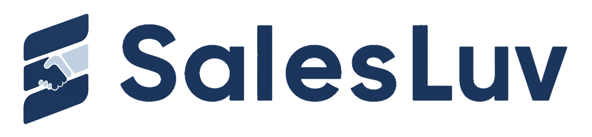

<div align="center">
  
  <h1>SalesLuv</h1>
  <h3>CONNECT THE HISTORY. APPROVE THE NEXT MOVE.</h3>
  <p>고객부터 보고서까지 연결하고, AI의 다음 행동을 사람이 승인하는 영업 운영 CRM</p>
  <p>
    
    
    
    
    
    
  </p>
</div>

---

## Team Cass Terra

서비스 **SalesLuv**를 만드는 4인 팀 **카스테라(Cass Terra)**입니다.

<table>
  <tr>
    <td align="center">
      <a href="https://github.com/SEONGBAE0201">
        <br />
        <sub><b>천성배</b></sub>
      </a><br />
      <sub>PM · OCR<br />자료실 요약 에이전트</sub>
    </td>
    <td align="center">
      <a href="https://github.com/j3s30p">
        <br />
        <sub><b>박제섭</b></sub>
      </a><br />
      <sub>기술 리드<br />멀티에이전트 구조 설계<br />미팅 분석 · 보고서 작성 에이전트</sub>
    </td>
    <td align="center">
      <a href="https://github.com/jexists">
        <br />
        <sub><b>정주애</b></sub>
      </a><br />
      <sub>프론트엔드 · 백엔드 · 인프라</sub>
    </td>
    <td align="center">
      <a href="https://github.com/jiyu-park">
        <br />
        <sub><b>박지유</b></sub>
      </a><br />
      <sub>계약관리 · 일정관리 에이전트</sub>
    </td>
  </tr>
</table>

---

## 01. SalesLuv

SalesLuv는 고객·딜·일정·미팅 기록·보고서를 하나의 맥락으로 잇고, AI가 만든 초안과 제안을 **사람이 검토·승인한 뒤에만** 실제 업무에 반영하는 CRM입니다.

### 이런 문제를 풉니다

영업 담당자 개인에게만 남는 암묵지는 이직·인수인계 때 그대로 사라집니다.

| 문제 | 현장 상황 |
|---|---|
| **암묵지 소실** | 고객 맥락·상담 히스토리·영업 노하우가 담당자 머릿속과 개인 파일에만 존재 |
| **정보 분산** | 고객·상담·일정·문서가 CRM·엑셀·메신저·캘린더에 분리 |
| **보고 중복** | 미팅 내용을 다시 정리해 일일·주간 보고에 반복 입력 |
| **다음 행동 부재** | 기록은 남지만 후속 업무·계약 갱신·다음 일정이 연결되지 않음 |
| **팀 현황 불투명** | 팀장이 일정·보고·매출·리스크를 수작업으로 재취합 |

### 해결 방식

차별점은 "자동 입력" 하나가 아니라, **맥락을 모아 판단하고 승인받아 재계산하는 흐름**입니다.

| | 핵심 기능 | 설명 |
|---|---|---|
| 01 | **통합 맥락 카드** | 고객·딜·활동·결정자·이슈를 한 화면에서 연결 |
| 02 | **업무 보고서 초안** | 원문과 CRM으로 초안·근거를 저장하되, 보고서 제출·업무 확정은 사용자 검토 후 처리 |
| 03 | **딜 × 포트폴리오 판단** | 딜 내부의 다음 행동과, 여러 딜 사이의 우선순위를 분리해 판단 |
| 04 | **승인 게이트** | CRM 변경·캘린더 등록·보고서 확정은 사람의 승인 후에만 반영 |

자세한 배경·시장 근거·MVP 완료 기준은 [프로젝트 개요](docs/project-overview.md)를 참고하세요.

---

## 02. 핵심 기능

### 업무 영역

| 영역 | 주요 기능 |
|---|---|
| 접속·조회 범위 | 로그인, 역할 권한, 팀 전체·본인·단일·복수 팀원 선택 |
| 대시보드 | 공지, KPI, Weekly Plan, Today Plan, 미팅 목록·상세, 일정 등록 |
| 고객·C/S | 고객 목록·상세·등록·가져오기·내보내기, 감정 분석, C/S 대응 이력 |
| 캘린더 | 미팅·업무 일정 등록·수정·삭제, 동행자·장소·마감일, 팀 일정 조회 |
| AI 미팅·업무보고 | 미팅 브리핑·요약·보고 초안, 첨부·활동 선택, 팀장 코멘트·검토 |
| 영업현황 | 영업 단계별 목록·상세와 고객·활동·견적·계약 연결 |
| 견적·계약·발주 | 견적 템플릿·현황, 계약 목록·상세·필터, 발주 5단계 |
| 매출분석 | 주·월·분기·반기·연도, 계약·지역·상품 기준 분석과 팀원 비교 |
| 자료실 | 문서 목록·다운로드·AI 요약, 폴더·업로드·이동·이름 변경 |
| 팀 관리 | 구성원, 직함·역할·재직 상태, 월 매출 목표 |

### 사용자 흐름

| 단계 | 사용자 행동 | SalesLuv 지원 |
|---|---|---|
| 1 | 오늘의 우선순위 확인 | 전체 딜·일정·미완료 업무를 모아 표시 |
| 2 | 미팅 준비 | 고객·계약·발주·과거 기록 기반 브리핑 제공 |
| 3 | 미팅 결과 입력 | STT·OCR·직접 입력 내용을 보고서 근거로 연결 |
| 4 | 보고서 확정 | AI 초안을 사용자가 수정·검토·제출 |
| 5 | 후속 업무 반영 | 승인된 변경을 CRM과 일정에 반영하고 다음 행동 제안 |
| 6 | 팀 검토·분석 | 보고서 코멘트·검토 상태와 업무·매출 분석 제공 |

> 운영 원칙: AI는 분석·준비·초안·제안까지, 최종 확정은 사람의 선택과 승인으로.

---

## 03. AI 멀티에이전트

미팅·보고서·딜·계약·일정·자료실 업무를 나누어 지원합니다. 아래 이미지는 전체 협업 구조이며, 세부 입출력과 에이전트 간 교류는 [멀티에이전트 운영 플로우](docs/technical/multiagent/SalesLuv_멀티에이전트_운영_플로우.html)를 기준으로 합니다.


| 에이전트 | 역할 |
|---|---|
| 미팅 분석 | 원문을 공통·딜별·미지정으로 귀속하고 13개 특성으로 변환해 계약 가능성을 분류 |
| 요청별 보고서 Supervisor | 유형별 writer와 공통 reviewer를 호출해 초안 작성·검토·선택 수정을 수행 |
| 영업·계약관리 | 고객사별 딜·계약·C/S를 함께 관리하고 다음 미팅과 브리핑을 제안 |
| 일정관리 | 전체 캘린더와 고객사별 미팅 제안을 종합해 충돌 없는 일정을 추천 |
| 자료요약 | 자료실 문서를 요약하고 영업 브리핑의 RAG 근거로 제공 |

C/S 요청 등록, 보고서 확정처럼 업무에 반영되는 결과는 자동 확정하지 않고 사용자 검토 후 처리합니다.

`meeting_processing`이 근거를 고정하면 worker가 보고서와 특성·ML 분석을 병렬로 실행합니다. 서버가 검증한 초안·검토 artifact에서 최종 후보를 조립하고, 실행 결과와 초안을 저장하며, 미팅 화면에는 SSE 미리보기를 표시합니다. ML 결과는 보고서 입력으로 쓰지 않습니다. Agent 런타임은 Deep Agents·LangChain·LangGraph를 사용합니다.

현재 구현·저장 경계 → [미팅·보고서 구조](docs/technical/multiagent/미팅_내용분석_보고서작성_에이전트_구조_보고서.md), [코드 위치](docs/project-structure.md#미팅보고서-처리)

에이전트별 입출력과 상호작용 → [프로젝트 개요](docs/project-overview.md#7-ai-멀티에이전트-운영-구조)

---

## 04. 기술 스택

**Frontend**<br>


**Backend**<br>


**Database**<br>


**AI · Document**<br>


**DevOps**<br>


**Quality**<br>


선정 이유와 전체 목록 → [기술 스택 상세](docs/tech-stack.md)

---

## 05. 로컬 실행

필수 도구는 Git, Node 24, uv입니다.

```bash
bash scripts/setup.sh
bash scripts/dev.sh
```

| 서비스 | 주소 |
|---|---|
| 프론트엔드 | `http://localhost:5173` |
| API 문서 | `http://localhost:8000/docs` |
| DB 상태 | `http://localhost:8000/api/health/db` |

환경변수와 개별 실행 방법은 [시작하기](docs/getting-started.md)를 참고하세요.

---

## 06. 개발 일정

<details>
<summary><b>WBS 7주 계획</b></summary>

<br>

| 주차 | 기간 | 핵심 진행 내용 |
|---|---|---|
| 1W | 8/3~8/7 | 요구사항 분석 및 프로젝트 기획 |
| 2W | 8/10~8/14 | 데이터·DB 기반 구축 / 화면 설계 시작 |
| 3W 전반 | 8/17~8/20 | 프론트엔드·백엔드 개발 시작 / 중간 발표 |
| 3W 후반 | 8/21 | 데이터 전처리·학습 및 AI 모델링 시작 |
| 4W | 8/24~8/28 | 데이터 전처리·학습 / AI 모델링 및 웹 개발 |
| 5W | 8/31~9/4 | AI 모델 평가 / 프론트엔드·백엔드·AI 기능 통합 |
| 6W | 9/7~9/11 | 통합 테스트 / 오류 수정 / 배포 검증 |
| 7W | 9/14~9/18 | 최종 산출물 검수 / 발표 및 제출 |

</details>

---

## 07. 문서

| 문서 | 용도 |
|---|---|
| [시작하기](docs/getting-started.md) | 로컬 실행과 환경 설정 |
| [프로젝트 개요](docs/project-overview.md) | 문제·시장·시나리오·MVP 완료 기준 |
| [기술 스택 상세](docs/tech-stack.md) | 전체 스택과 선정 이유 |
| [프로젝트 구조](docs/project-structure.md) | 파일·폴더 배치 |
| [SalesLuv ERD](docs/technical/SalesLuv_ERD.md) | 테이블·컬럼 기준 ERD |
| [SQL 가이드](backend/sql/README.md) | 스키마 변경 절차 |
| [AGENTS.md](AGENTS.md) | 사람과 AI가 공유하는 개발 규칙 원본 |
| [문서 목록](docs/README.md) | 그 외 문서 전체 안내 |
