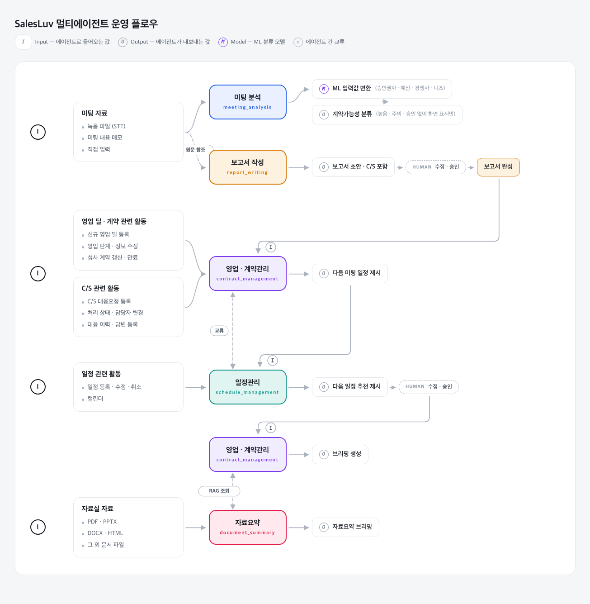

# SalesLuv

> **CONNECT THE HISTORY. APPROVE THE NEXT MOVE.**

영업의 흐름을 연결하고 다음 행동을 제안하는 CRM입니다.
고객·딜·일정·미팅 기록·보고서를 하나의 맥락으로 잇고, AI가 만든 초안과 제안을 **사람이 검토·승인한 뒤에만** 실제 업무에 반영합니다.

---

## 이런 문제를 풉니다

영업 담당자 개인에게만 남는 암묵지는 이직·인수인계 때 그대로 사라집니다.

| 문제 | 현장 상황 |
|---|---|
| **암묵지 소실** | 고객 맥락·상담 히스토리·영업 노하우가 담당자 머릿속과 개인 파일에만 존재 |
| **정보 분산** | 고객·상담·일정·문서가 CRM·엑셀·메신저·캘린더에 분리 |
| **보고 중복** | 미팅 내용을 다시 정리해 일일·주간 보고에 반복 입력 |
| **다음 행동 부재** | 기록은 남지만 후속 업무·계약 갱신·다음 일정이 연결되지 않음 |
| **팀 현황 불투명** | 팀장이 일정·보고·매출·리스크를 수작업으로 재취합 |

## 어떻게 다른가요

차별점은 "자동 입력" 하나가 아니라, **맥락을 모아 판단하고 승인받아 재계산하는 흐름**입니다.

| | 핵심 기능 | 설명 |
|---|---|---|
| 01 | **통합 맥락 카드** | 고객·딜·활동·결정자·이슈를 한 화면에서 연결 |
| 02 | **업무 보고서 초안** | STT·OCR·직접 입력을 바탕으로 보고서와 변경안을 생성. 사람이 확정하기 전에는 저장하지 않음 |
| 03 | **딜 × 포트폴리오 판단** | 딜 내부의 다음 행동과, 여러 딜 사이의 우선순위를 분리해 판단 |
| 04 | **승인 게이트** | CRM 변경·캘린더 등록·보고서 확정은 사람의 승인 후에만 반영 |

## 핵심 기능

| 영역 | 주요 기능 |
|---|---|
| 접속·조회 범위 | 로그인, 역할 권한, 팀 전체·본인·단일·복수 팀원 선택 |
| 대시보드 | 공지, KPI, Weekly Plan, Today Plan, 미팅 목록·상세, 일정 등록 |
| 고객·C/S | 고객 목록·상세·등록·가져오기·내보내기, 감정 분석, C/S 대응 이력 |
| 캘린더 | 미팅·업무 일정 등록·수정·삭제, 동행자·장소·마감일, 팀 일정 조회 |
| AI 미팅·업무보고 | 미팅 브리핑·요약·보고 초안, 첨부·활동 선택, 팀장 코멘트·검토 |
| 영업현황 | 영업 단계별 목록·상세와 고객·활동·견적·계약 연결 |
| 견적·계약·발주 | 견적 템플릿·현황, 계약 목록·상세·필터, 발주 5단계 |
| 매출분석 | 주·월·분기·반기·연도, 계약·지역·상품 기준 분석과 팀원 비교 |
| 자료실 | 문서 목록·다운로드·AI 요약, 폴더·업로드·이동·이름 변경 |
| 팀 관리 | 구성원, 직함·역할·재직 상태, 월 매출 목표 |

<b>사용자 시나리오 6단계</b>

 

| 단계 | 사용자 행동 | 담당 |
|---|---|---|
| 1 | 오늘의 우선순위 — 전체 딜 비교 | 포트폴리오 판단 |
| 2 | 미팅 전 브리핑 — 히스토리·질문·준비물 | 딜 판단 |
| 3 | 미팅 후 입력 — STT·OCR·직접 입력 | 보고서 작성 |
| 4 | 보고서 확정 — 수정·검토·승인 | **사용자** |
| 5 | 정보 반영 — CRM 저장·재계산 | 딜 → 포트폴리오 |
| 6 | 업무·매출 분석 | 분석 |

> 운영 원칙: AI는 분석·준비·초안·제안까지, 최종 확정은 사람의 선택과 승인으로.

자세한 배경·시장 근거·MVP 완료 기준은 [프로젝트 개요](docs/project-overview.md)를 참고하세요.

## AI 멀티에이전트 구조

미팅·보고서·딜·계약·일정·자료실 업무를 5개 에이전트가 나누어 지원합니다.

| 에이전트 | 역할 |
|---|---|
| 미팅 분석 | C/S 탐지 및 딜 승산 점수 계산 |
| 보고서 작성 | 미팅 원문과 C/S 내용을 기반으로 보고서 초안 생성 |
| 영업·계약관리 | 딜별 독립 세션으로 진행 상황 관리 및 다음 미팅 제안 |
| 일정관리 | 전체 캘린더와 세션별 미팅 제안을 통합·조정 |
| 자료요약 | 자료실 문서의 핵심 내용 요약 |

C/S 요청 등록, 보고서 확정처럼 업무에 반영되는 결과는 자동 확정하지 않고 사용자 검토 후 처리합니다.

에이전트별 입출력과 상호작용 → [프로젝트 개요](docs/project-overview.md#7-ai-멀티에이전트-운영-구조)

## 기술 스택

**Frontend** 

**Backend** 

**Database** 

**DevOps · Quality** 

**도입 예정** *(검토 중)* 

선정 이유와 전체 목록 → [기술 스택 상세](docs/tech-stack.md)

## 팀

서비스명 **셀럽(SalesLuv)** · 팀명 **카스테라(Cass Terra)**

| 이름 | 주 담당 | 서브 |
|---|---|---|
| 천성배 | PM | 프론트엔드 |
| 정주애 | 프론트엔드 | 백엔드 |
| 박지유 | 인프라 | 기획 |
| 박제섭 | 백엔드 | 인프라 |

AI 에이전트 설계·개발은 팀 전원이 함께 진행합니다.

## 개발 일정

<b>WBS 7주 계획</b>

 

| 주차 | 기간 | 핵심 진행 내용 |
|---|---|---|
| 1W | 8/3~8/7 | 요구사항 분석 및 프로젝트 기획 |
| 2W | 8/10~8/14 | 데이터·DB 기반 구축 / 화면 설계 시작 |
| 3W 전반 | 8/17~8/20 | 프론트엔드·백엔드 개발 시작 / 중간 발표 |
| 3W 후반 | 8/21 | 데이터 전처리·학습 및 AI 모델링 시작 |
| 4W | 8/24~8/28 | 데이터 전처리·학습 / AI 모델링 및 웹 개발 |
| 5W | 8/31~9/4 | AI 모델 평가 / 프론트엔드·백엔드·AI 기능 통합 |
| 6W | 9/7~9/11 | 통합 테스트 / 오류 수정 / 배포 검증 |
| 7W | 9/14~9/18 | 최종 산출물 검수 / 발표 및 제출 |

## 문서

| 문서 | 용도 |
|---|---|
| [시작하기](docs/getting-started.md) | 로컬 실행과 환경 설정 |
| [프로젝트 개요](docs/project-overview.md) | 문제·시장·시나리오·MVP 완료 기준 |
| [기술 스택 상세](docs/tech-stack.md) | 전체 스택과 선정 이유 |
| [프로젝트 구조](docs/project-structure.md) | 파일·폴더 배치 |
| [SalesLuv ERD](docs/technical/SalesLuv_ERD.md) | 테이블·컬럼 기준 ERD |
| [SQL 가이드](backend/sql/README.md) | 스키마 변경 절차 |
| [AGENTS.md](AGENTS.md) | 사람과 AI가 공유하는 개발 규칙 원본 |
| [문서 목록](docs/README.md) | 그 외 문서 전체 안내 |
