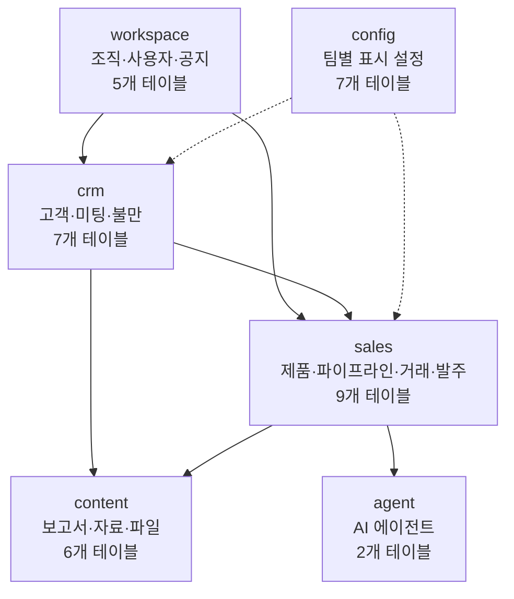
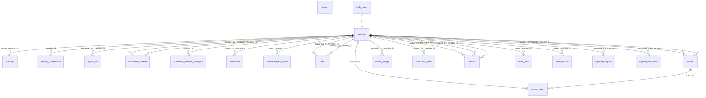
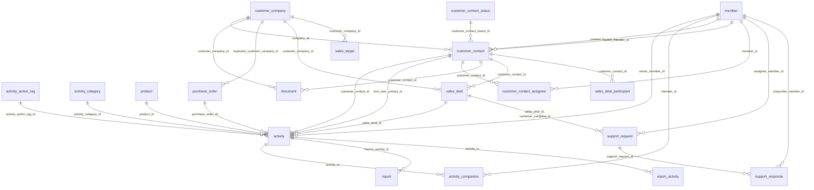
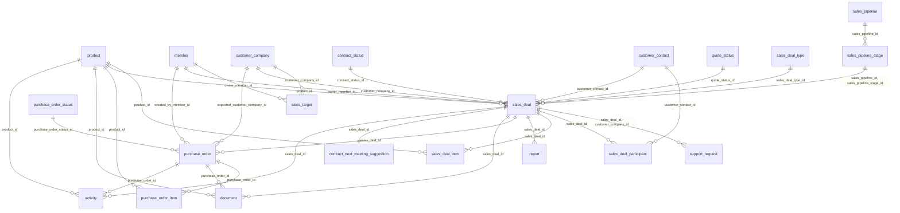
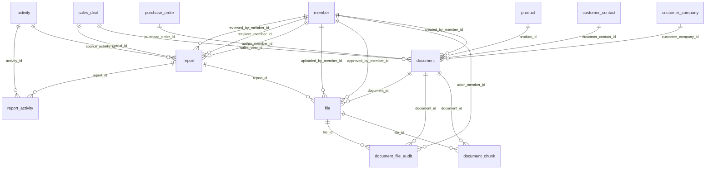
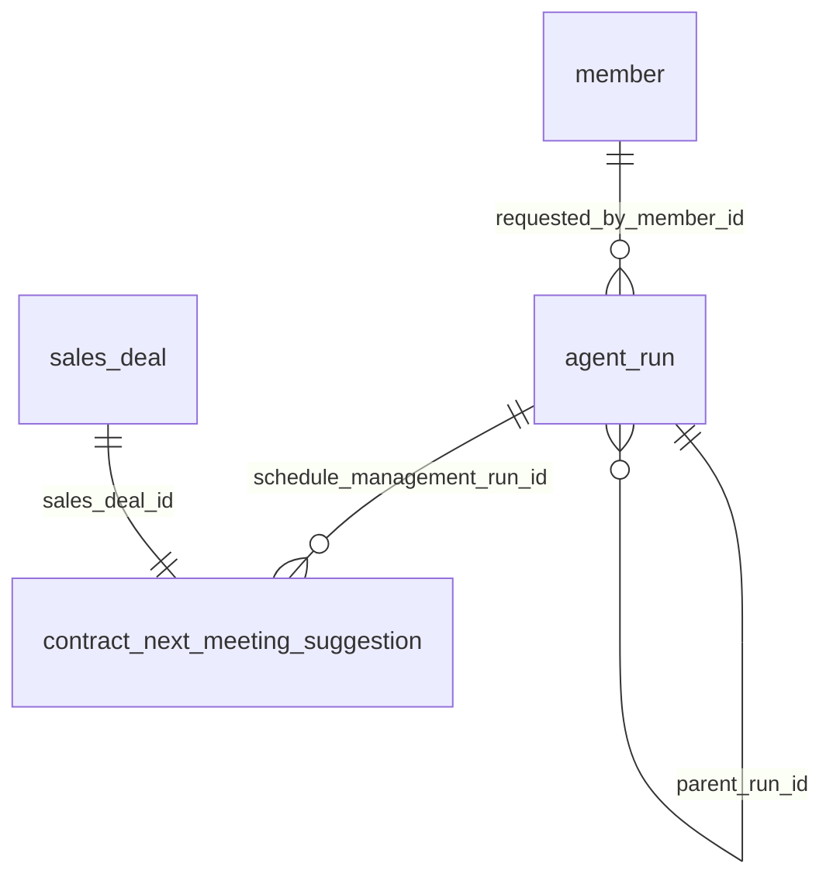
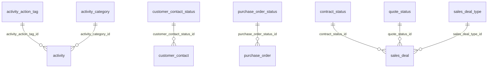

# ERD

테이블 간 관계만 그린다. 컬럼은 `tables/{테이블명}.md` 를 본다.

> 확대·이동·검색·테이블 클릭이 되는 그림은 [erd.html](erd.html) 을 브라우저로 열면 된다.

관계선의 `||--o{` 는 1:N, `||--||` 는 1:1 이다. 선 위 글자는 자식 쪽 외래 키 컬럼이다.

## 1. 도메인 구성

## 2. team 이 잡는 소속 범위

```mermaid
erDiagram
    team ||--o{ activity : "team_id"
    team ||--o{ activity_action_tag : "team_id"
    team ||--o{ activity_category : "team_id"
    team ||--o{ agent_run : "team_id"
    team ||--o{ contract_next_meeting_suggestion : "team_id"
    team ||--o{ contract_status : "team_id"
    team ||--o{ customer_company : "team_id"
    team ||--o{ customer_contact_status : "team_id"
    team ||--o{ document : "team_id"
    team ||--o{ document_chunk : "team_id"
    team ||--o{ document_file_audit : "team_id"
    team ||--o{ member : "team_id"
    team ||--o{ notice : "team_id"
    team ||--o{ notice_image : "team_id"
    team ||--o{ product : "team_id"
    team ||--o{ purchase_order : "team_id"
    team ||--o{ purchase_order_status : "team_id"
    team ||--o{ quote_status : "team_id"
    team ||--o{ report : "team_id"
    team ||--o{ sales_deal : "team_id"
    team ||--o{ sales_deal_type : "team_id"
    team ||--o{ sales_pipeline : "team_id"
    team ||--o{ support_request : "team_id"
```

`team_id` 를 가진 테이블은 모두 팀 단위로 나뉜다. 아래 도메인별 그림에서는 이 선을 생략한다.

## 3. workspace — 조직·사용자·공지

## 4. crm — 고객·미팅·불만

## 5. sales — 제품·파이프라인·거래·발주

## 6. content — 보고서·자료·파일

## 7. agent — AI 에이전트

## 8. config — 팀별 표시 설정

## 9. 전체

선이 많아 보기 어렵다. 관계를 따라가려면 [erd.html](erd.html) 을 쓴다.

```mermaid
erDiagram
    activity_action_tag ||--o{ activity : "activity_action_tag_id"
    activity_category ||--o{ activity : "activity_category_id"
    customer_contact ||--o{ activity : "customer_contact_id"
    customer_contact ||--o{ activity : "end_user_contact_id"
    member ||--o{ activity : "owner_member_id"
    product ||--o{ activity : "product_id"
    purchase_order ||--o{ activity : "purchase_order_id"
    sales_deal ||--o{ activity : "sales_deal_id"
    team ||--o{ activity : "team_id"
    team ||--o{ activity_action_tag : "team_id"
    team ||--o{ activity_category : "team_id"
    activity ||--o{ activity_companion : "activity_id"
    member ||--o{ activity_companion : "member_id"
    agent_run ||--o{ agent_run : "parent_run_id"
    member ||--o{ agent_run : "requested_by_member_id"
    team ||--o{ agent_run : "team_id"
    agent_run ||--o{ contract_next_meeting_suggestion : "schedule_management_run_id"
    sales_deal ||--|| contract_next_meeting_suggestion : "sales_deal_id"
    team ||--o{ contract_next_meeting_suggestion : "team_id"
    team ||--o{ contract_status : "team_id"
    team ||--o{ customer_company : "team_id"
    customer_company ||--o{ customer_contact : "company_id"
    member ||--o{ customer_contact : "created_by_member_id"
    customer_contact_status ||--o{ customer_contact : "customer_contact_status_id"
    member ||--o{ customer_contact : "owner_member_id"
    customer_contact ||--o{ customer_contact_assignee : "customer_contact_id"
    member ||--o{ customer_contact_assignee : "member_id"
    team ||--o{ customer_contact_status : "team_id"
    member ||--o{ document : "created_by_member_id"
    customer_company ||--o{ document : "customer_company_id"
    customer_contact ||--o{ document : "customer_contact_id"
    product ||--o{ document : "product_id"
    purchase_order ||--o{ document : "purchase_order_id"
    sales_deal ||--o{ document : "sales_deal_id"
    team ||--o{ document : "team_id"
    document ||--o{ document_chunk : "document_id"
    file ||--o{ document_chunk : "file_id"
    team ||--o{ document_chunk : "team_id"
    member ||--o{ document_file_audit : "actor_member_id"
    document ||--o{ document_file_audit : "document_id"
    file ||--o{ document_file_audit : "file_id"
    team ||--o{ document_file_audit : "team_id"
    member ||--o{ file : "approved_by_member_id"
    document ||--o{ file : "document_id"
    report ||--o{ file : "report_id"
    member ||--o{ file : "uploaded_by_member_id"
    auth_users ||--|| member : "id"
    team ||--o{ member : "team_id"
    member ||--o{ notice : "author_member_id"
    member ||--o{ notice : "recipient_member_id"
    team ||--o{ notice : "team_id"
    team ||--o{ notice_image : "team_id"
    member ||--o{ notice_image : "uploaded_by_member_id"
    member ||--o{ notice_target : "member_id"
    notice ||--o{ notice_target : "notice_id"
    team ||--o{ product : "team_id"
    member ||--o{ purchase_order : "created_by_member_id"
    customer_company ||--o{ purchase_order : "expected_customer_company_id"
    purchase_order_status ||--o{ purchase_order : "purchase_order_status_id"
    sales_deal ||--o{ purchase_order : "sales_deal_id"
    team ||--o{ purchase_order : "team_id"
    product ||--o{ purchase_order_item : "product_id"
    purchase_order ||--o{ purchase_order_item : "purchase_order_id"
    team ||--o{ purchase_order_status : "team_id"
    team ||--o{ quote_status : "team_id"
    member ||--o{ report : "author_member_id"
    member ||--o{ report : "recipient_member_id"
    member ||--o{ report : "reviewed_by_member_id"
    sales_deal ||--o{ report : "sales_deal_id"
    activity ||--o{ report : "source_activity_id"
    team ||--o{ report : "team_id"
    activity ||--o{ report_activity : "activity_id"
    report ||--o{ report_activity : "report_id"
    contract_status ||--o{ sales_deal : "contract_status_id"
    customer_company ||--o{ sales_deal : "customer_company_id"
    customer_contact ||--o{ sales_deal : "customer_contact_id"
    member ||--o{ sales_deal : "owner_member_id"
    product ||--o{ sales_deal : "product_id"
    quote_status ||--o{ sales_deal : "quote_status_id"
    sales_deal_type ||--o{ sales_deal : "sales_deal_type_id"
    sales_pipeline_stage ||--o{ sales_deal : "sales_pipeline_id, sales_pipeline_stage_id"
    team ||--o{ sales_deal : "team_id"
    product ||--o{ sales_deal_item : "product_id"
    sales_deal ||--o{ sales_deal_item : "sales_deal_id"
    customer_contact ||--o{ sales_deal_participant : "customer_contact_id"
    sales_deal ||--o{ sales_deal_participant : "sales_deal_id"
    team ||--o{ sales_deal_type : "team_id"
    team ||--o{ sales_pipeline : "team_id"
    sales_pipeline ||--o{ sales_pipeline_stage : "sales_pipeline_id"
    customer_company ||--o{ sales_target : "customer_company_id"
    member ||--o{ sales_target : "owner_member_id"
    member ||--o{ support_request : "assignee_member_id"
    sales_deal ||--o{ support_request : "sales_deal_id, customer_company_id"
    team ||--o{ support_request : "team_id"
    member ||--o{ support_response : "responder_member_id"
    support_request ||--o{ support_response : "support_request_id"
```

---

[← 전체 테이블 목록](README.md) · [관계 전체](RELATIONS.md)
