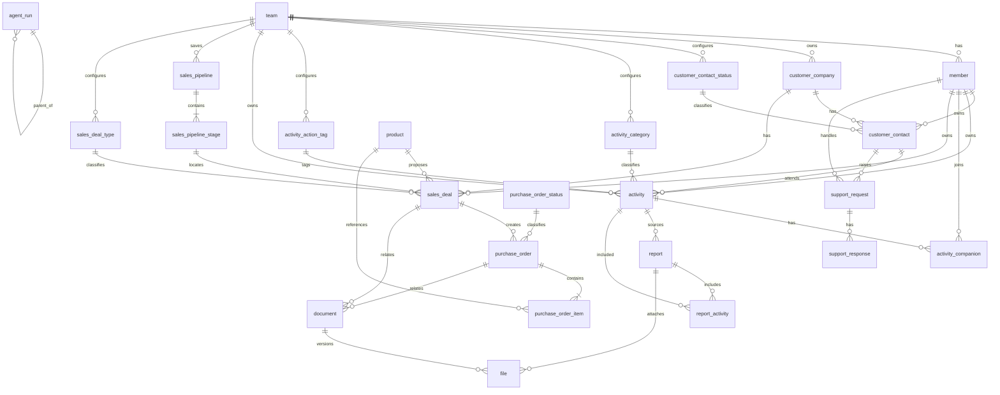

# SalesLuv ERD

> 기준: `backend/sql/20260819_0001_baseline_schema.sql`을 적용한 `public` 스키마<br>
> 규모: **26테이블 / 264컬럼 / 외래키 65개** (public 대상 64개 + `member.id` → `auth.users.id` 1개)<br>
> 상세 운영 설계: [데이터베이스 저장소 설계 문서](데이터베이스_저장소_설계_문서_260817.docx)

## 1. 표기와 설계 원칙

- 테이블명과 컬럼명은 설명용 별칭이 아니라 실제 물리 식별자다.
- `NN`은 `NOT NULL`, `NULL`은 NULL 허용, `PK`는 기본키, `FK`는 외래키, `UQ`는 유일 제약이다.
- 시간형은 PostgreSQL `timestamptz`, 금액형은 `bigint`, 구조화 스냅샷은 `jsonb`를 사용한다.
- 화면 표시용 합계·진행률·최근 접촉·다음 일정은 원천 데이터에서 계산하고 중복 저장하지 않는다.
- `team`이 데이터 경계다. 단일 FK로 보장할 수 없는 같은 팀·같은 담당자 범위는 API가 검증한다.
- 26개 테이블 모두 RLS가 활성화되어 있다. 현재 SQL에는 RLS 정책이 없으므로 애플리케이션의 팀 범위 검증을 생략할 수 없다.
- `deleted_at`이 있는 업무·설정 데이터는 soft delete한다. 과거 레코드가 참조하는 설정 행은 hard delete하지 않는다.

## 2. 핵심 관계



`sales_deal`의 `(sales_pipeline_id, sales_pipeline_stage_id)`는 `sales_pipeline_stage(sales_pipeline_id, id)`를 참조하는 **하나의 복합 FK 제약**이다. 따라서 단계가 선택한 파이프라인에 속함을 DB가 보장하며, `sales_deal.sales_pipeline_id`에서 `sales_pipeline.id`로 가는 중복 FK는 두지 않는다.

### FK 제약조건 전수 목록

| 테이블 | 개수 | FK 컬럼 → 참조 |
|---|---:|---|
| `team` | 0 | — |
| `member` | 1 | `team_id → team.id` |
| `customer_company` | 1 | `team_id → team.id` |
| `customer_contact_status` | 1 | `team_id → team.id` |
| `customer_contact` | 3 | `company_id → customer_company.id`; `owner_member_id → member.id`; `customer_contact_status_id → customer_contact_status.id` |
| `activity_category` | 1 | `team_id → team.id` |
| `activity_action_tag` | 1 | `team_id → team.id` |
| `activity` | 9 | `team_id → team.id`; `owner_member_id → member.id`; `customer_contact_id,end_user_contact_id → customer_contact.id`; `activity_category_id → activity_category.id`; `activity_action_tag_id → activity_action_tag.id`; `product_id → product.id`; `sales_deal_id → sales_deal.id`; `purchase_order_id → purchase_order.id` |
| `activity_companion` | 2 | `activity_id → activity.id`; `member_id → member.id` |
| `notice` | 3 | `team_id → team.id`; `author_member_id,recipient_member_id → member.id` |
| `support_request` | 3 | `team_id → team.id`; `customer_contact_id → customer_contact.id`; `assignee_member_id → member.id` |
| `support_response` | 2 | `support_request_id → support_request.id`; `responder_member_id → member.id` |
| `product` | 1 | `team_id → team.id` |
| `sales_deal_type` | 1 | `team_id → team.id` |
| `sales_pipeline` | 1 | `team_id → team.id` |
| `sales_pipeline_stage` | 1 | `sales_pipeline_id → sales_pipeline.id` |
| `sales_deal` | 7 | `team_id → team.id`; `customer_company_id → customer_company.id`; `customer_contact_id → customer_contact.id`; `owner_member_id → member.id`; `product_id → product.id`; `sales_deal_type_id → sales_deal_type.id`; `(sales_pipeline_id,sales_pipeline_stage_id) → sales_pipeline_stage(sales_pipeline_id,id)` |
| `purchase_order_status` | 1 | `team_id → team.id` |
| `purchase_order` | 3 | `team_id → team.id`; `sales_deal_id → sales_deal.id`; `purchase_order_status_id → purchase_order_status.id` |
| `purchase_order_item` | 2 | `purchase_order_id → purchase_order.id`; `product_id → product.id` |
| `sales_target` | 2 | `owner_member_id → member.id`; `customer_company_id → customer_company.id` |
| `report` | 5 | `team_id → team.id`; `author_member_id,recipient_member_id,reviewed_by_member_id → member.id`; `source_activity_id → activity.id` |
| `report_activity` | 2 | `report_id → report.id`; `activity_id → activity.id` |
| `document` | 5 | `team_id → team.id`; `created_by_member_id → member.id`; `customer_company_id → customer_company.id`; `sales_deal_id → sales_deal.id`; `purchase_order_id → purchase_order.id` |
| `file` | 3 | `report_id → report.id`; `document_id → document.id`; `uploaded_by_member_id → member.id` |
| `agent_run` | 3 | `team_id → team.id`; `parent_run_id → agent_run.id`; `requested_by_member_id → member.id` |
| **합계** | **64** | 복합 FK는 컬럼이 두 개여도 제약조건 하나로 계산 |

## 3. 물리 데이터 사전

### 3.1 조직·사용자

#### `team` — 3컬럼

| 컬럼 | 타입 | NULL | 키·기본값·검사 |
|---|---|---|---|
| `id` | `uuid` | NN | PK |
| `name` | `text` | NN | `btrim(name) <> ''` |
| `created_at` | `timestamptz` | NN | `DEFAULT now()` |

#### `member` — 7컬럼

로그인은 Supabase Auth가 담당한다. `member` 행 하나가 auth 사용자 하나이며, 별도 연결
컬럼 없이 PK 자체를 `auth.users.id`로 맞춘다.

| 컬럼 | 타입 | NULL | 키·기본값·검사 |
|---|---|---|---|
| `id` | `uuid` | NN | PK, FK → `auth.users.id` |
| `team_id` | `uuid` | NN | FK → `team.id` |
| `display_name` | `text` | NN | 비어 있지 않음 |
| `role_code` | `text` | NN | `member \| manager` |
| `job_title` | `text` | NULL | 값이 있으면 비어 있지 않음 |
| `active` | `boolean` | NN | `DEFAULT true` |
| `created_at` | `timestamptz` | NN | `DEFAULT now()` |

### 3.2 고객·일정·지원

#### `customer_company` — 5컬럼

| 컬럼 | 타입 | NULL | 키·기본값·검사 |
|---|---|---|---|
| `id` | `uuid` | NN | PK |
| `team_id` | `uuid` | NN | FK → `team.id` |
| `name` | `text` | NN | 비어 있지 않음, `(team_id, name)` 유일 인덱스 |
| `region_code` | `text` | NULL | 값이 있으면 비어 있지 않음 |
| `created_at` | `timestamptz` | NN | `DEFAULT now()` |

#### `customer_contact_status` — 9컬럼

팀장이 관리할 수 있는 고객 담당자 상태의 표시값이다. `code`는 저장용 안정 식별자이고 `name`, `tone`, `position`은 표시 편의를 위한 값이다.

| 컬럼 | 타입 | NULL | 키·기본값·검사 |
|---|---|---|---|
| `id` | `uuid` | NN | PK |
| `team_id` | `uuid` | NN | FK → `team.id` |
| `code` | `text` | NN | 비어 있지 않음, UQ `(team_id, code)` |
| `name` | `text` | NN | 비어 있지 않음 |
| `tone` | `text` | NN | `gray \| blue \| purple \| orange \| green \| red` |
| `position` | `integer` | NN | `>= 0` |
| `deleted_at` | `timestamptz` | NULL | soft delete |
| `created_at` | `timestamptz` | NN | `DEFAULT now()` |
| `updated_at` | `timestamptz` | NN | `DEFAULT now()` |

기본값은 `new`, `proposal`, `negotiation`, `contracted`, `on_hold`다.

#### `customer_contact` — 12컬럼

| 컬럼 | 타입 | NULL | 키·기본값·검사 |
|---|---|---|---|
| `id` | `uuid` | NN | PK |
| `company_id` | `uuid` | NN | FK → `customer_company.id` |
| `owner_member_id` | `uuid` | NN | FK → `member.id` |
| `name` | `text` | NN | 비어 있지 않음 |
| `department` | `text` | NULL | 값이 있으면 비어 있지 않음 |
| `job_title` | `text` | NULL | 값이 있으면 비어 있지 않음 |
| `email` | `text` | NULL | 값이 있으면 비어 있지 않음 |
| `phone` | `text` | NN | 비어 있지 않음 |
| `customer_contact_status_id` | `uuid` | NULL | FK → `customer_contact_status.id` |
| `source_code` | `text` | NULL | 값이 있으면 비어 있지 않음 |
| `memo` | `text` | NULL | 값이 있으면 비어 있지 않음 |
| `registered_at` | `timestamptz` | NN | `DEFAULT now()` |

#### `activity_category` — 10컬럼

| 컬럼 | 타입 | NULL | 키·기본값·검사 |
|---|---|---|---|
| `id` | `uuid` | NN | PK |
| `team_id` | `uuid` | NN | FK → `team.id` |
| `code` | `text` | NN | 비어 있지 않음, UQ `(team_id, code)` |
| `name` | `text` | NN | 비어 있지 않음 |
| `tone` | `text` | NN | 여섯 `tone` 값 중 하나 |
| `position` | `integer` | NN | `>= 0` |
| `deleted_at` | `timestamptz` | NULL | soft delete |
| `created_at` | `timestamptz` | NN | `DEFAULT now()` |
| `updated_at` | `timestamptz` | NN | `DEFAULT now()` |
| `activity_type` | `text` | NN | `meeting \| task` |

기본값은 `visit`, `demo`, `education`, `call`, `delivery`, `conference`(`meeting`)와 `internal`(`task`)이다.

#### `activity_action_tag` — 10컬럼

| 컬럼 | 타입 | NULL | 키·기본값·검사 |
|---|---|---|---|
| `id` | `uuid` | NN | PK |
| `team_id` | `uuid` | NN | FK → `team.id` |
| `code` | `text` | NN | 비어 있지 않음, UQ `(team_id, code)` |
| `name` | `text` | NN | 비어 있지 않음 |
| `tone` | `text` | NN | 여섯 `tone` 값 중 하나 |
| `position` | `integer` | NN | `>= 0` |
| `deleted_at` | `timestamptz` | NULL | soft delete |
| `created_at` | `timestamptz` | NN | `DEFAULT now()` |
| `updated_at` | `timestamptz` | NN | `DEFAULT now()` |
| `activity_type` | `text` | NN | `meeting \| task` |

기본 코드는 `first_call`, `meeting`, `demo_requested`, `demo_in_progress`, `demo_completed`, `quote_completed`, `contract_completed`, `product_training`, `delivery_completed`, `internal_meeting`, `weekly_review`, `monthly_review`, `quarterly_review`, `conference`, `ojt`다. 각 행의 `activity_type`은 바뀌지 않는 시스템 의미다.

#### `activity` — 22컬럼

| 컬럼 | 타입 | NULL | 키·기본값·검사 |
|---|---|---|---|
| `id` | `uuid` | NN | PK |
| `team_id` | `uuid` | NN | FK → `team.id` |
| `owner_member_id` | `uuid` | NN | FK → `member.id` |
| `customer_contact_id` | `uuid` | NULL | FK → `customer_contact.id` |
| `end_user_contact_id` | `uuid` | NULL | FK → `customer_contact.id` |
| `activity_type` | `text` | NN | `meeting \| task` |
| `activity_category_id` | `uuid` | NN | FK → `activity_category.id` |
| `title` | `text` | NN | 비어 있지 않음 |
| `starts_at` | `timestamptz` | NN |  |
| `ends_at` | `timestamptz` | NULL | `ends_at > starts_at` |
| `all_day` | `boolean` | NN | `DEFAULT false` |
| `due_at` | `timestamptz` | NULL |  |
| `location` | `text` | NULL | 값이 있으면 비어 있지 않음 |
| `activity_action_tag_id` | `uuid` | NULL | FK → `activity_action_tag.id` |
| `completed_at` | `timestamptz` | NULL |  |
| `note` | `text` | NULL | 값이 있으면 비어 있지 않음 |
| `deleted_at` | `timestamptz` | NULL | soft delete |
| `created_at` | `timestamptz` | NN | `DEFAULT now()` |
| `updated_at` | `timestamptz` | NN | `DEFAULT now()` |
| `product_id` | `uuid` | NULL | FK → `product.id` |
| `sales_deal_id` | `uuid` | NULL | FK → `sales_deal.id` |
| `purchase_order_id` | `uuid` | NULL | FK → `purchase_order.id` |

`activity_type`과 선택한 category/action tag의 `activity_type` 일치는 API가 검사한다.

#### `activity_companion` — 2컬럼

| 컬럼 | 타입 | NULL | 키·기본값·검사 |
|---|---|---|---|
| `activity_id` | `uuid` | NN | PK/FK → `activity.id`, `ON DELETE CASCADE` |
| `member_id` | `uuid` | NN | PK/FK → `member.id` |

#### `notice` — 12컬럼

| 컬럼 | 타입 | NULL | 키·기본값·검사 |
|---|---|---|---|
| `id` | `uuid` | NN | PK |
| `team_id` | `uuid` | NN | FK → `team.id` |
| `author_member_id` | `uuid` | NN | FK → `member.id` |
| `recipient_member_id` | `uuid` | NULL | FK → `member.id`; NULL이면 팀 공지 |
| `tag` | `text` | NULL | 값이 있으면 비어 있지 않음 |
| `title` | `text` | NN | 비어 있지 않음 |
| `body` | `text` | NN | 비어 있지 않음 |
| `image_storage_key` | `text` | NULL | 값이 있으면 비어 있지 않음 |
| `image_alt` | `text` | NULL | 값이 있으면 비어 있지 않음 |
| `published_at` | `timestamptz` | NN | `DEFAULT now()` |
| `due_at` | `timestamptz` | NULL |  |
| `due_text` | `text` | NULL | 값이 있으면 비어 있지 않음 |

#### `support_request` — 9컬럼

| 컬럼 | 타입 | NULL | 키·기본값·검사 |
|---|---|---|---|
| `id` | `uuid` | NN | PK |
| `team_id` | `uuid` | NN | FK → `team.id` |
| `customer_contact_id` | `uuid` | NN | FK → `customer_contact.id` |
| `assignee_member_id` | `uuid` | NN | FK → `member.id` |
| `title` | `text` | NN | 비어 있지 않음 |
| `body` | `text` | NN | 비어 있지 않음 |
| `is_urgent` | `boolean` | NN | `DEFAULT false` |
| `status_code` | `text` | NN | 비어 있지 않음 |
| `registered_at` | `timestamptz` | NN | `DEFAULT now()` |

#### `support_response` — 5컬럼

| 컬럼 | 타입 | NULL | 키·기본값·검사 |
|---|---|---|---|
| `id` | `uuid` | NN | PK |
| `support_request_id` | `uuid` | NN | FK → `support_request.id` |
| `responder_member_id` | `uuid` | NN | FK → `member.id` |
| `body` | `text` | NN | 비어 있지 않음 |
| `responded_at` | `timestamptz` | NN | `DEFAULT now()` |

### 3.3 영업 파이프라인·딜·발주

#### `product` — 4컬럼

| 컬럼 | 타입 | NULL | 키·기본값·검사 |
|---|---|---|---|
| `id` | `uuid` | NN | PK |
| `team_id` | `uuid` | NN | FK → `team.id` |
| `name` | `text` | NN | 비어 있지 않음 |
| `active` | `boolean` | NN | `DEFAULT true` |

#### `sales_deal_type` — 8컬럼

| 컬럼 | 타입 | NULL | 키·기본값·검사 |
|---|---|---|---|
| `id` | `uuid` | NN | PK |
| `team_id` | `uuid` | NN | FK → `team.id` |
| `code` | `text` | NN | 비어 있지 않음, UQ `(team_id, code)` |
| `name` | `text` | NN | 비어 있지 않음 |
| `position` | `integer` | NN | `>= 0` |
| `deleted_at` | `timestamptz` | NULL | soft delete |
| `created_at` | `timestamptz` | NN | `DEFAULT now()` |
| `updated_at` | `timestamptz` | NN | `DEFAULT now()` |

기본값은 `new_installation`, `expansion`, `renewal`, `maintenance`, `consumables_supply`다.

#### `sales_pipeline` — 10컬럼

저장 가능한 영업 절차의 버전이다. 팀은 여러 파이프라인을 가질 수 있지만 기본 published 파이프라인은 하나만 가진다.

| 컬럼 | 타입 | NULL | 키·기본값·검사 |
|---|---|---|---|
| `id` | `uuid` | NN | PK |
| `team_id` | `uuid` | NN | FK → `team.id` |
| `name` | `text` | NN | 비어 있지 않음, UQ `(team_id, name)` |
| `description` | `text` | NULL | 값이 있으면 비어 있지 않음 |
| `status_code` | `text` | NN | `draft \| published \| archived` |
| `is_default` | `boolean` | NN | `DEFAULT false`; true이면 published |
| `published_at` | `timestamptz` | NULL | published/archived이면 필수 |
| `archived_at` | `timestamptz` | NULL | archived이면 필수, `>= published_at` |
| `created_at` | `timestamptz` | NN | `DEFAULT now()` |
| `updated_at` | `timestamptz` | NN | `DEFAULT now()` |

수명주기 검사는 다음 세 조합만 허용한다.

- `draft`: `published_at IS NULL`, `archived_at IS NULL`
- `published`: `published_at IS NOT NULL`, `archived_at IS NULL`
- `archived`: 두 시각 모두 존재하고 `archived_at >= published_at`

부분 유일 인덱스가 팀마다 `is_default=true AND status_code='published'`인 행을 최대 하나로 제한한다.

#### `sales_pipeline_stage` — 10컬럼

| 컬럼 | 타입 | NULL | 키·기본값·검사 |
|---|---|---|---|
| `id` | `uuid` | NN | PK |
| `sales_pipeline_id` | `uuid` | NN | FK → `sales_pipeline.id` |
| `stage_code` | `text` | NN | 비어 있지 않음, UQ `(sales_pipeline_id, stage_code)` |
| `name` | `text` | NN | 비어 있지 않음 |
| `tone` | `text` | NN | 여섯 `tone` 값 중 하나 |
| `phase_code` | `text` | NN | `sales \| quote \| contract \| order \| closed` |
| `outcome_code` | `text` | NN | `in_progress \| confirmed \| cancelled` |
| `position` | `integer` | NN | `>= 0`, UQ `(sales_pipeline_id, position)` |
| `created_at` | `timestamptz` | NN | `DEFAULT now()` |
| `updated_at` | `timestamptz` | NN | `DEFAULT now()` |

복합 FK의 참조 대상이 되도록 `(sales_pipeline_id, id)`도 UQ다.

기본 published 파이프라인 `기본 영업`은 다음 9개 단계를 제공한다.

| 순서 | `stage_code` | 이름 | `phase_code` | `outcome_code` |
|---:|---|---|---|---|
| 0 | `needs_validation` | 니즈 검증 | `sales` | `in_progress` |
| 1 | `product_demo` | 제품 시연 평가 | `sales` | `in_progress` |
| 2 | `quote_sent` | 견적서 발송 | `quote` | `in_progress` |
| 3 | `contract_sent` | 계약서 발송 | `contract` | `in_progress` |
| 4 | `contract_review` | 계약서 검토 | `contract` | `in_progress` |
| 5 | `contract_completed` | 계약 완료 | `contract` | `confirmed` |
| 6 | `order_in_progress` | 발주 진행 | `order` | `confirmed` |
| 7 | `order_delivered` | 납품 완료 | `order` | `confirmed` |
| 8 | `closed_cancelled` | 취소 | `closed` | `cancelled` |

#### `sales_deal` — 28컬럼

영업 시작, 견적, 계약, 발주 단계가 모두 이어지는 하나의 영업 기회다. 견적·계약 메타데이터도 같은 행에 보존한다.

| 컬럼 | 타입 | NULL | 키·기본값·검사 |
|---|---|---|---|
| `id` | `uuid` | NN | PK |
| `team_id` | `uuid` | NN | FK → `team.id` |
| `deal_no` | `text` | NN | 비어 있지 않음, UQ `(team_id, deal_no)` |
| `customer_company_id` | `uuid` | NN | FK → `customer_company.id` |
| `customer_contact_id` | `uuid` | NULL | FK → `customer_contact.id` |
| `owner_member_id` | `uuid` | NN | FK → `member.id` |
| `product_id` | `uuid` | NULL | FK → `product.id` |
| `sales_pipeline_id` | `uuid` | NN | 복합 FK 첫 컬럼 → `sales_pipeline_stage.sales_pipeline_id` |
| `sales_pipeline_stage_id` | `uuid` | NN | 복합 FK 둘째 컬럼 → `sales_pipeline_stage.id` |
| `title` | `text` | NN | 비어 있지 않음 |
| `description` | `text` | NULL | 값이 있으면 비어 있지 않음 |
| `sales_deal_type_id` | `uuid` | NN | FK → `sales_deal_type.id` |
| `deal_amount` | `bigint` | NN | `>= 0` |
| `opened_on` | `date` | NN | 딜 시작일 |
| `closed_on` | `date` | NULL | 파이프라인 종료일, `>= opened_on` |
| `quote_no` | `text` | NULL | 값이 있으면 비어 있지 않음, UQ `(team_id, quote_no)` |
| `quote_issued_on` | `date` | NULL | `>= opened_on` |
| `quote_valid_until` | `date` | NULL | `quote_issued_on` 필수, `>= quote_issued_on` |
| `contract_no` | `text` | NULL | 값이 있으면 비어 있지 않음, UQ `(team_id, contract_no)` |
| `contract_signed_on` | `date` | NULL | 실제 계약 체결일, `>= opened_on` |
| `contract_ends_on` | `date` | NULL | `contract_signed_on` 필수, `>= contract_signed_on` |
| `warranty_terms` | `text` | NULL | 값이 있으면 비어 있지 않음 |
| `expected_delivery_at` | `timestamptz` | NULL | 납품 예정 시각 |
| `memo` | `text` | NULL | 값이 있으면 비어 있지 않음 |
| `stage_position` | `integer` | NN | `>= 0` |
| `deleted_at` | `timestamptz` | NULL | soft delete |
| `created_at` | `timestamptz` | NN | `DEFAULT now()` |
| `updated_at` | `timestamptz` | NN | `DEFAULT now()` |

`closed_on`은 계약 체결일이나 매출 확정일이 아니다. 확정 매출의 귀속일은 `contract_signed_on`이다. 단계 이동과 고객·담당자·상품의 같은 팀 조건은 API가 한 트랜잭션에서 검증한다.

#### `purchase_order_status` — 10컬럼

| 컬럼 | 타입 | NULL | 키·기본값·검사 |
|---|---|---|---|
| `id` | `uuid` | NN | PK |
| `team_id` | `uuid` | NN | FK → `team.id` |
| `code` | `text` | NN | 비어 있지 않음, UQ `(team_id, code)` |
| `name` | `text` | NN | 비어 있지 않음 |
| `tone` | `text` | NN | 여섯 `tone` 값 중 하나 |
| `position` | `integer` | NN | `>= 0` |
| `deleted_at` | `timestamptz` | NULL | soft delete |
| `created_at` | `timestamptz` | NN | `DEFAULT now()` |
| `updated_at` | `timestamptz` | NN | `DEFAULT now()` |
| `outcome_code` | `text` | NN | `in_progress \| completed \| cancelled` |

기본 상태는 `order_received`, `dispatch_request_completed`, `in_production`, `stock_received`, `delivered`, `cancelled`이다.

#### `purchase_order` — 13컬럼

고객사와 담당자는 중복 저장하지 않고 필수 연결인 `sales_deal`에서 파생한다.

| 컬럼 | 타입 | NULL | 키·기본값·검사 |
|---|---|---|---|
| `id` | `uuid` | NN | PK |
| `team_id` | `uuid` | NN | FK → `team.id` |
| `order_no` | `text` | NN | 비어 있지 않음, UQ `(team_id, order_no)` |
| `sales_deal_id` | `uuid` | NN | FK → `sales_deal.id` |
| `supplier_name` | `text` | NN | 비어 있지 않음 |
| `purchase_order_status_id` | `uuid` | NN | FK → `purchase_order_status.id` |
| `ordered_on` | `date` | NN |  |
| `due_on` | `date` | NN | `>= ordered_on` |
| `expected_receipt_on` | `date` | NN | `>= ordered_on` |
| `memo` | `text` | NULL | 값이 있으면 비어 있지 않음 |
| `deleted_at` | `timestamptz` | NULL | soft delete |
| `created_at` | `timestamptz` | NN | `DEFAULT now()` |
| `updated_at` | `timestamptz` | NN | `DEFAULT now()` |

#### `purchase_order_item` — 6컬럼

| 컬럼 | 타입 | NULL | 키·기본값·검사 |
|---|---|---|---|
| `id` | `uuid` | NN | PK |
| `purchase_order_id` | `uuid` | NN | FK → `purchase_order.id`, `ON DELETE CASCADE` |
| `product_id` | `uuid` | NN | FK → `product.id` |
| `quantity` | `integer` | NN | `> 0` |
| `unit_price` | `bigint` | NN | `>= 0` |
| `position` | `integer` | NN | `>= 0` |

#### `sales_target` — 5컬럼

| 컬럼 | 타입 | NULL | 키·기본값·검사 |
|---|---|---|---|
| `id` | `uuid` | NN | PK |
| `owner_member_id` | `uuid` | NN | FK → `member.id` |
| `customer_company_id` | `uuid` | NN | FK → `customer_company.id` |
| `target_month` | `date` | NN | 해당 월 1일만 허용 |
| `target_amount` | `bigint` | NN | `>= 0` |

UQ는 `(owner_member_id, customer_company_id, target_month)`다.

### 3.4 보고·자료·Agent 실행

#### `report` — 20컬럼

| 컬럼 | 타입 | NULL | 키·기본값·검사 |
|---|---|---|---|
| `id` | `uuid` | NN | PK |
| `team_id` | `uuid` | NN | FK → `team.id` |
| `author_member_id` | `uuid` | NN | FK → `member.id` |
| `recipient_member_id` | `uuid` | NULL | FK → `member.id` |
| `template_snapshot` | `jsonb` | NN | 작성 시점 양식 스냅샷 |
| `source_activity_id` | `uuid` | NULL | FK → `activity.id` |
| `report_kind` | `text` | NN | 비어 있지 않음 |
| `report_date` | `date` | NN |  |
| `period_start` | `date` | NULL |  |
| `period_end` | `date` | NULL | 둘 다 있으면 `>= period_start` |
| `status_code` | `text` | NN | 비어 있지 않음 |
| `content` | `jsonb` | NN | 보고 내용 |
| `transcript` | `text` | NULL | 값이 있으면 비어 있지 않음 |
| `source_snapshot` | `jsonb` | NULL | 생성 당시 원천 스냅샷 |
| `ai_evidence` | `jsonb` | NULL | 생성 근거 |
| `note` | `text` | NULL | 값이 있으면 비어 있지 않음 |
| `reviewed_by_member_id` | `uuid` | NULL | FK → `member.id` |
| `reviewed_at` | `timestamptz` | NULL |  |
| `created_at` | `timestamptz` | NN | `DEFAULT now()` |
| `updated_at` | `timestamptz` | NN | `DEFAULT now()` |

#### `report_activity` — 2컬럼

| 컬럼 | 타입 | NULL | 키·기본값·검사 |
|---|---|---|---|
| `report_id` | `uuid` | NN | PK/FK → `report.id`, `ON DELETE CASCADE` |
| `activity_id` | `uuid` | NN | PK/FK → `activity.id` |

#### `document` — 12컬럼

| 컬럼 | 타입 | NULL | 키·기본값·검사 |
|---|---|---|---|
| `id` | `uuid` | NN | PK |
| `team_id` | `uuid` | NN | FK → `team.id` |
| `created_by_member_id` | `uuid` | NN | FK → `member.id` |
| `document_no` | `text` | NN | 비어 있지 않음 |
| `category_code` | `text` | NN | 비어 있지 않음 |
| `title` | `text` | NN | 비어 있지 않음 |
| `description` | `text` | NULL | 값이 있으면 비어 있지 않음 |
| `customer_company_id` | `uuid` | NULL | FK → `customer_company.id` |
| `sales_deal_id` | `uuid` | NULL | FK → `sales_deal.id` |
| `purchase_order_id` | `uuid` | NULL | FK → `purchase_order.id` |
| `tags` | `jsonb` | NN | `DEFAULT '[]'::jsonb`, JSON 배열만 허용 |
| `created_at` | `timestamptz` | NN | `DEFAULT now()` |

#### `file` — 13컬럼

| 컬럼 | 타입 | NULL | 키·기본값·검사 |
|---|---|---|---|
| `id` | `uuid` | NN | PK |
| `report_id` | `uuid` | NULL | FK → `report.id` |
| `document_id` | `uuid` | NULL | FK → `document.id` |
| `version_no` | `integer` | NULL | 문서 파일이면 `>= 1`, 보고서 파일이면 NULL |
| `file_name` | `text` | NN | 비어 있지 않음 |
| `storage_key` | `text` | NN | UQ, 비어 있지 않음 |
| `media_type` | `text` | NULL | 값이 있으면 비어 있지 않음 |
| `byte_size` | `bigint` | NN | `>= 0` |
| `processing_status` | `text` | NN | `uploaded \| processing \| completed \| failed` |
| `extracted_text` | `text` | NULL | 값이 있으면 비어 있지 않음 |
| `uploaded_by_member_id` | `uuid` | NN | FK → `member.id` |
| `note` | `text` | NULL | 값이 있으면 비어 있지 않음 |
| `uploaded_at` | `timestamptz` | NN | `DEFAULT now()` |

`num_nonnulls(report_id, document_id) = 1`이며 `(document_id, version_no)`는 UQ다.

#### `agent_run` — 17컬럼

| 컬럼 | 타입 | NULL | 키·기본값·검사 |
|---|---|---|---|
| `id` | `uuid` | NN | PK |
| `team_id` | `uuid` | NN | FK → `team.id` |
| `parent_run_id` | `uuid` | NULL | FK → `agent_run.id`, 자기 자신 금지 |
| `requested_by_member_id` | `uuid` | NULL | FK → `member.id` |
| `agent_code` | `text` | NN | 비어 있지 않음 |
| `trigger_code` | `text` | NN | 비어 있지 않음 |
| `idempotency_key` | `uuid` | NULL | 값이 있으면 요청자 필수 |
| `status_code` | `text` | NN | `queued \| running \| completed \| failed` |
| `llm_model_name` | `text` | NN | 비어 있지 않음 |
| `prompt_version` | `text` | NN | 비어 있지 않음 |
| `source_refs` | `jsonb` | NN | 원천 레코드 식별자 |
| `input_snapshot` | `jsonb` | NN | 실행 입력 스냅샷 |
| `output_snapshot` | `jsonb` | NULL | 실행 출력 |
| `evidence` | `jsonb` | NULL | 출력 근거 |
| `error_message` | `text` | NULL | 값이 있으면 비어 있지 않음 |
| `started_at` | `timestamptz` | NULL |  |
| `finished_at` | `timestamptz` | NULL |  |

UQ는 `(requested_by_member_id, idempotency_key)`다. 고정 Agent 코드는 `meeting_analysis`, `report_writing`, `contract_management`, `schedule_management`, `document_summary`다.

미팅 분석 실행은 다음 구조를 사용한다.

```json
{
  "agent_code": "meeting_analysis",
  "source_refs": {
    "activity_id": "uuid",
    "sales_deal_id": "uuid"
  },
  "output_snapshot": {
    "support_candidates": [],
    "deal_assessment": {
      "features": {},
      "score": 0,
      "model_version": "string"
    }
  }
}
```

- 점수는 `0~100`이고 같은 딜의 `completed` 실행 중 `finished_at DESC, id DESC` 첫 행을 표시한다.
- 재분석은 이전 행을 덮어쓰지 않고 새 `agent_run`을 추가한다.
- `support_candidates`는 제안이다. 사용자가 확정한 항목만 별도 트랜잭션으로 `support_request`에 저장한다.

## 4. 고정 의미와 팀별 표시 설정

다음 값은 필터·상태 전이에 사용하는 고정 시스템 의미이므로 팀장이 변경하지 않는다.

| 구분 | 고정값 |
|---|---|
| 영업 phase | `sales`, `quote`, `contract`, `order`, `closed` |
| 영업 결과 | `in_progress`, `confirmed`, `cancelled` |
| 일정 성격 | `meeting`, `task` |
| 발주 결과 | `in_progress`, `completed`, `cancelled` |
| 파이프라인 수명주기 | `draft`, `published`, `archived` |

팀별 표시 편의값은 `customer_contact_status`, `activity_category`, `activity_action_tag`, `sales_deal_type`, `purchase_order_status` 행으로 관리한다. 현재 기본값은 초기 제공값이며 이후 추가·수정·soft delete할 수 있다. 이때 과거 레코드의 FK와 마지막 표시값은 유지되고 신규 입력 선택지에서만 제외된다.

## 5. 파이프라인 버전 규칙

- `draft`만 파이프라인과 단계의 이름·색상·순서·구조를 수정할 수 있다.
- `published` 파이프라인과 그 단계는 모든 필드를 불변으로 취급한다. DB 트리거가 아니라 API가 이 규칙을 강제한다.
- 변경은 기존 published 정의를 복사한 새 draft에서 수행한 뒤 publish한다.
- 기존 딜은 기존 `sales_pipeline_id`와 `sales_pipeline_stage_id`를 계속 사용한다.
- 새 딜부터 새 published 파이프라인을 선택할 수 있다.
- `archived`는 신규 딜과 단계 이동 선택지에서 제외하지만 기존 딜 조회에는 남긴다.
- 한 팀의 기본 published 파이프라인은 하나다.

## 6. 화면의 phase 포함 규칙

| 화면 | 조회 규칙 |
|---|---|
| 영업현황 | 접근 가능한 `sales_deal` 전체 |
| 견적현황 | 현재 단계의 `phase_code = 'quote'` |
| 계약현황 | 현재 단계의 `phase_code = 'contract'` |
| 발주현황 | 현재 단계의 `phase_code = 'order'` |

화면명, 단계명, 단계 순번으로 포함 여부를 추정하지 않는다. 예를 들어 계약 phase의 딜을 발주 phase 단계로 이동하면 계약현황에서는 빠지고 발주현황에 나타나며, 영업현황에는 계속 표시된다.

## 7. 마이그레이션 보존 규칙

- `contract`는 `sales_deal`, `pipeline_stage`는 `sales_pipeline_stage`로 이름을 바꾸되 기존 UUID를 보존한다.
- 기존 `contract.contract_date`는 모든 행에서 `sales_deal.opened_on`으로 보존한다.
- 기존 단계가 `confirmed`였던 행만 `contract_signed_on = opened_on`으로 조건부 보정한다.
- 기존 발주는 반드시 딜과 연결되며 고객사·담당자는 딜에서 파생한다.
- 알 수 없는 legacy 단계·상태, 중복 업무 번호, 팀·고객·담당자 불일치가 있으면 추정하지 않고 `0005` 트랜잭션 전체를 중단한다.
