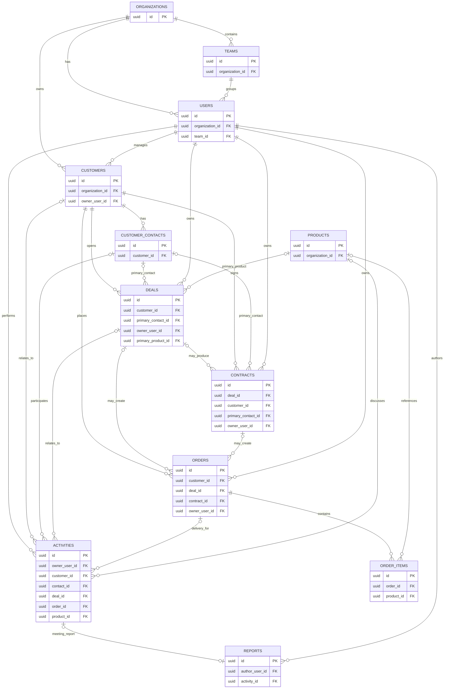
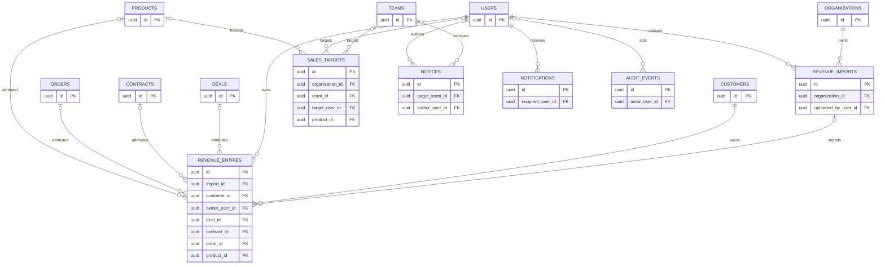

# SalesLuv MVP ERD 초안

> 기준일: 2026-08-12
> 기준 커밋: `origin/develop@332deb1`
> 화면 기준: `demo/layout_v3.html`
> 제품·Agent 흐름 기준: `docs/technical/멀티에이전트_플로우.html`
> DB 가정: PostgreSQL, 업무 시간대 `Asia/Seoul`, 금액은 원 단위 정수

표에서 `NULL`이라고 쓰지 않은 컬럼은 모두 `NOT NULL`이다. `FK`에는 `(organization_id, foreign_id)` 복합 FK도 포함한다.

## 1. 먼저 결정할 내용

사용자가 제안한 큰 뼈대는 모두 유지하되, 현재 화면과 운영 플로우를 실제로 저장할 수 있도록 **18개 테이블**로 나눈다.

| 제안한 영역 | MVP 결정 | 이유 |
|---|---|---|
| `USERS` | `organizations` + `teams` + `users` | API 권한 범위가 조직·팀·사용자이고, 팀장 화면과 Team Reduce가 팀 단위를 사용한다. |
| `CUSTOMERS` | `customers` + `customer_contacts` | 한 회사에 여러 담당자·의사결정자가 있으므로 회사와 사람은 반드시 분리한다. |
| `DEAL` | `deals` + `contracts` | Deal은 계약 전 영업기회이고 Contract는 체결 결과다. 합치면 진행 중 딜과 유효 계약을 구분할 수 없다. |
| 상품 | `products` 추가 | 같은 상품이 딜·일정·발주·매출·목표에서 반복되므로 이름 문자열 중복을 막는다. |
| `SCHEDULE` | `activities`로 확대·통합 | 방문 일정, 미팅, 전화, 후속업무, C/S 요청, 고객 이력을 한 활동 원장에서 처리한다. |
| `REPORTS` | `reports` 한 테이블 | 미팅·일일·주간·월간 보고서는 수명주기가 같아 `report_type`으로 합친다. |
| `ORDERS` | `orders` + `order_items` | 한 발주에 여러 품목·수량·단가가 들어가므로 품목은 반드시 분리한다. |
| `REVENUE` | `revenue_imports` + `revenue_entries` + `sales_targets` | xlsx 업로드 묶음, 확정 매출 원장, 목표는 서로 다른 원본이다. 매출 보고서는 이들을 집계한다. |
| 알람·notice | `notices` + `notifications` | 팀 공지는 공유 콘텐츠이고 개인 알림은 수신자와 읽음 상태가 필요하다. |
| AI 승인 변경 | `audit_events` 추가 | AI가 제안하고 사용자가 승인한 변경의 주체·전후값을 남겨야 한다. |

### 반드시 분리할 것

1. `customers`와 `customer_contacts`
2. `deals`와 `contracts`
3. `orders`와 `order_items`
4. `revenue_entries`와 `sales_targets`
5. `notices`와 `notifications`

### 합쳐도 되는 것

1. 방문·미팅·전화·후속업무·C/S 요청 → `activities.activity_type`
2. 미팅·일일·주간·월간 보고서 → `reports.report_type`
3. 최근 접촉·다음 일정·지연 여부·파이프라인 합계·매출 달성률 → 별도 테이블 없이 조회 시 계산

## 2. 관계도

관계도에는 읽기 쉬우라고 PK와 주요 FK만 표시했다. 전체 컬럼은 3장의 데이터 사전이 기준이다. 발주 품목은 저장 완료 시 1개 이상이어야 하지만 작성 중 빈 발주를 허용하므로 관계도는 `0..N`으로 표시한다.

### 2-1. 핵심 CRM·영업 운영

### 2-2. 매출·목표·공지·감사

## 3. 테이블·컬럼 데이터 사전

### 3-1. `organizations` — SalesLuv를 사용하는 회사

**분리 이유:** 고객사 데이터와 권한이 서로 섞이지 않게 하는 최상위 테넌트다.

| 컬럼 | 타입·제약 | 설명 | 넣는 이유 |
|---|---|---|---|
| `id` | `uuid PK` | 조직 식별자 | 모든 데이터 범위의 기준이다. |
| `name` | `text NOT NULL` | 조직명 | 화면과 관리 기능에서 조직을 식별한다. |
| `created_at` | `timestamptz NOT NULL` | 생성 시각 | 생성 이력을 남긴다. |
| `updated_at` | `timestamptz NOT NULL` | 수정 시각 | 설정 변경 시점을 확인한다. |

### 3-2. `teams` — 조직 안의 영업팀

**분리 이유:** 팀장 대시보드, 팀 목표, Team Reduce, 팀 범위 권한의 기준이다.

| 컬럼 | 타입·제약 | 설명 | 넣는 이유 |
|---|---|---|---|
| `id` | `uuid PK` | 팀 식별자 | 사용자와 팀 목표를 연결한다. |
| `organization_id` | `uuid FK` | 소속 조직 | 다른 조직의 팀 참조를 막는다. |
| `name` | `text NOT NULL` | 팀명 | 팀 관리·대시보드에 표시한다. |
| `status` | `text NOT NULL` | `active` / `inactive` | 팀을 삭제하지 않고 운영 중단한다. |
| `planning_version` | `bigint NOT NULL DEFAULT 1` | 현재 Portfolio 입력 버전 | 승인 목표가 바뀔 때 증가시켜 재계획 대상을 표시한다. |
| `planned_version` | `bigint NOT NULL DEFAULT 0` | 마지막 성공 계획 버전 | 현재 버전보다 작으면 Portfolio가 다시 실행되어야 한다. |
| `created_at` | `timestamptz NOT NULL` | 생성 시각 | 생성 이력을 남긴다. |
| `updated_at` | `timestamptz NOT NULL` | 수정 시각 | 팀명·상태 변경을 추적한다. |

### 3-3. `users` — 영업 담당자와 팀장

**분리 이유:** 로그인 주체, 데이터 소유자, 보고 작성자, 승인자를 한 기준으로 참조한다.

| 컬럼 | 타입·제약 | 설명 | 넣는 이유 |
|---|---|---|---|
| `id` | `uuid PK` | 사용자 식별자 | 모든 담당·작성·승인 FK의 기준이다. |
| `organization_id` | `uuid FK` | 소속 조직 | 사용자 권한 범위를 제한한다. |
| `team_id` | `uuid FK` | 소속 팀 | 팀원·팀장 화면과 집계 범위를 정한다. |
| `auth_subject` | `text NULL UNIQUE` | 인증 제공자의 사용자 ID | 인증 방식과 CRM 사용자 정보를 분리한다. |
| `email` | `text NOT NULL` | 로그인·연락 이메일 | 사용자를 식별하고 초대한다. |
| `display_name` | `text NOT NULL` | 표시 이름 | 담당 영업·작성자 이름에 사용한다. |
| `role` | `text NOT NULL` | `member` / `manager` | 본인 범위와 팀 범위 권한을 구분한다. |
| `status` | `text NOT NULL` | `invited` / `active` / `inactive` | 퇴사·정지 계정을 삭제하지 않고 차단한다. |
| `created_at` | `timestamptz NOT NULL` | 생성 시각 | 계정 생성 이력을 남긴다. |
| `updated_at` | `timestamptz NOT NULL` | 수정 시각 | 역할·상태 변경을 추적한다. |

`password_hash`는 인증 방식을 정한 뒤 로컬 인증을 선택할 때만 추가한다. 비밀번호 원문은 저장하지 않는다.

### 3-4. `customers` — 회사·기관 등 거래처 계정

**분리 이유:** 사람 한 명이 아니라 거래 관계의 주체인 회사·기관을 저장한다.

| 컬럼 | 타입·제약 | 설명 | 넣는 이유 |
|---|---|---|---|
| `id` | `uuid PK` | 거래처 식별자 | 담당자·딜·계약·발주의 상위 기준이다. |
| `organization_id` | `uuid FK` | 소유 조직 | 테넌트 간 고객 데이터 혼합을 막는다. |
| `owner_user_id` | `uuid FK` | 기본 담당 영업 | 고객 배정과 “내 고객” 조회에 사용한다. |
| `name` | `text NOT NULL` | 회사·기관명 | 고객 목록의 대표 이름이다. |
| `customer_type` | `text NOT NULL` | `company` / `institution` / `sole_proprietor` | 거래처 성격을 최소 구분한다. |
| `domain` | `text NULL` | 회사 웹 도메인 | 중복 회사 확인과 기본 정보에 사용한다. |
| `phone` | `text NULL` | 대표 전화 | 회사 공통 연락처를 저장한다. |
| `address` | `text NULL` | 대표 주소 | 방문 일정의 장소 입력을 돕는다. |
| `lifecycle_status` | `text NOT NULL` | `prospect` / `active` / `inactive` | 거래 전·거래 중·비활성을 구분한다. |
| `memo` | `text NULL` | 회사 공통 메모 | 사람 한 명에 속하지 않는 맥락을 남긴다. |
| `archived_at` | `timestamptz NULL` | 보관 시각 | 참조 이력을 지키며 목록에서 숨긴다. |
| `created_at` | `timestamptz NOT NULL` | 등록 시각 | 화면의 등록일에 사용한다. |
| `updated_at` | `timestamptz NOT NULL` | 수정 시각 | 최신 고객 정보 판단에 사용한다. |

화면의 `신규/제안/협의/계약/보류`는 고객 상태가 아니라 활성 `deal.stage`로 본다.

### 3-5. `customer_contacts` — 거래처에서 실제로 만나는 사람

**분리 이유:** 한 회사에 구매 담당자·실무자·의사결정자가 여러 명 존재한다.

| 컬럼 | 타입·제약 | 설명 | 넣는 이유 |
|---|---|---|---|
| `id` | `uuid PK` | 담당자 식별자 | 딜·계약·일정의 사람 참조 기준이다. |
| `organization_id` | `uuid FK` | 소유 조직 | 조직 경계를 FK에서 검증한다. |
| `customer_id` | `uuid FK` | 소속 거래처 | 사람과 회사를 1:N으로 연결한다. |
| `name` | `text NOT NULL` | 이름 | 고객 목록과 일정에 표시한다. |
| `department` | `text NULL` | 부서 | 회사 안 역할과 접촉 맥락을 남긴다. |
| `job_title` | `text NULL` | 직함 | 의사결정 영향력을 판단할 기초 정보다. |
| `email` | `text NULL` | 이메일 | 연락과 검색에 사용한다. |
| `phone` | `text NULL` | 전화번호 | 연락과 일정 준비에 사용한다. |
| `source` | `text NULL` | 소개·박람회·홈페이지 등 | 유입 경로를 분석한다. |
| `is_primary` | `boolean NOT NULL DEFAULT false` | 회사 대표 담당자 여부 | 고객 목록의 기본 담당자를 고른다. |
| `memo` | `text NULL` | 사람별 메모 | 개인별 요구·관계 맥락을 남긴다. |
| `archived_at` | `timestamptz NULL` | 보관 시각 | 퇴사한 담당자를 이력과 함께 보존한다. |
| `created_at` | `timestamptz NOT NULL` | 등록 시각 | 등록 이력을 남긴다. |
| `updated_at` | `timestamptz NOT NULL` | 수정 시각 | 연락처 최신성을 확인한다. |

### 3-6. `products` — 판매 상품·서비스 기준정보

**분리 이유:** 같은 상품을 딜·발주·매출·목표에서 일관된 ID로 사용한다.

| 컬럼 | 타입·제약 | 설명 | 넣는 이유 |
|---|---|---|---|
| `id` | `uuid PK` | 상품 식별자 | 여러 업무 테이블의 공통 상품 FK다. |
| `organization_id` | `uuid FK` | 소유 조직 | 조직별 상품 카탈로그를 분리한다. |
| `sku` | `text NULL` | 내부 상품 코드 | 상품명이 바뀌어도 같은 상품을 식별한다. |
| `name` | `text NOT NULL` | 상품·서비스명 | 화면과 문서에 표시한다. |
| `category` | `text NULL` | 상품 분류 | 필터와 상품별 집계를 돕는다. |
| `default_unit_price` | `bigint NULL` | 기본 단가 | 새 발주 입력의 기본값으로만 사용한다. |
| `status` | `text NOT NULL` | `active` / `inactive` | 과거 참조를 보존하며 판매 중단한다. |
| `created_at` | `timestamptz NOT NULL` | 생성 시각 | 상품 등록 이력을 남긴다. |
| `updated_at` | `timestamptz NOT NULL` | 수정 시각 | 이름·기본 단가 변경을 확인한다. |

과거 발주 가격은 `products.default_unit_price`가 아니라 `order_items.unit_price`가 기준이다.

### 3-7. `deals` — 계약 전 영업기회

**분리 이유:** 고객별 제안·협의·성공·실패 과정과 예상 매출을 관리한다.

| 컬럼 | 타입·제약 | 설명 | 넣는 이유 |
|---|---|---|---|
| `id` | `uuid PK` | 딜 식별자 | Deal Agent 세션의 `deal_id` 기준이다. |
| `organization_id` | `uuid FK` | 소유 조직 | 다른 조직의 딜 접근을 막는다. |
| `customer_id` | `uuid FK` | 대상 거래처 | 영업기회를 고객과 연결한다. |
| `primary_contact_id` | `uuid FK NULL` | 대표 고객 담당자 | MVP에서 딜의 핵심 연락처 한 명을 지정한다. |
| `owner_user_id` | `uuid FK` | 실제 딜 담당 영업 | Portfolio Agent의 사용자 범위와 담당 배정 기준이다. |
| `primary_product_id` | `uuid FK NULL` | 주 제안 상품 | 상품별 파이프라인과 일정 준비에 사용한다. |
| `title` | `text NOT NULL` | 딜명 | 목록과 Agent 문맥에서 식별한다. |
| `stage` | `text NOT NULL` | `new` / `qualified` / `proposal` / `negotiation` / `contract_review` / `on_hold` | 열린 딜의 진행 단계를 표현한다. |
| `status` | `text NOT NULL` | `open` / `won` / `lost` | 진행 중과 최종 결과를 분리한다. |
| `expected_amount` | `bigint NULL` | 예상 계약액 | 파이프라인 가치를 계산한다. |
| `expected_close_date` | `date NULL` | 예상 종결일 | 마감 임박·정체 규칙의 입력이다. |
| `closed_at` | `timestamptz NULL` | 실제 종결 시각 | 성사·실패 기간을 계산한다. |
| `lost_reason` | `text NULL` | 실패 사유 | 실패 분석과 후속 학습에 사용한다. |
| `memo` | `text NULL` | 딜 공통 메모 | 구조화되지 않은 영업 맥락을 남긴다. |
| `analysis_input_version` | `bigint NOT NULL DEFAULT 1` | 현재 분석 입력 버전 | 신규 Deal을 dirty로 시작하고 관련 확정 데이터가 바뀔 때 증가시킨다. |
| `analyzed_input_version` | `bigint NOT NULL DEFAULT 0` | 마지막 성공 분석 버전 | 입력 버전보다 작으면 Deal Agent가 다시 실행되어야 한다. |
| `archived_at` | `timestamptz NULL` | 보관 시각 | 과거 관계를 유지하며 기본 목록에서 숨긴다. |
| `created_at` | `timestamptz NOT NULL` | 생성 시각 | 딜 생성 이력을 남긴다. |
| `updated_at` | `timestamptz NOT NULL` | 수정 시각 | 딜 자체 변경 이벤트를 감지하는 기준으로 사용한다. |

위험도·우선순위·추천 이유는 Agent의 판단 결과이므로 확정 CRM 원본 컬럼으로 중복 저장하지 않는다.

### 3-8. `contracts` — 체결된 계약과 갱신 기준

**분리 이유:** 계약 번호·유효기간·체결액은 Deal의 예상값과 다른 법적·업무 원본이다.

| 컬럼 | 타입·제약 | 설명 | 넣는 이유 |
|---|---|---|---|
| `id` | `uuid PK` | 계약 식별자 | 발주와 매출의 계약 근거 FK다. |
| `organization_id` | `uuid FK` | 소유 조직 | 계약 데이터의 조직 경계를 강제한다. |
| `contract_no` | `text NOT NULL` | 계약 번호 | 화면·문서에서 계약을 식별한다. |
| `deal_id` | `uuid FK NULL` | 성사된 원 딜 | 기존 계약 이관도 허용하려고 nullable로 둔다. |
| `customer_id` | `uuid FK` | 계약 상대 거래처 | 계약 당사자를 명시한다. |
| `primary_contact_id` | `uuid FK NULL` | 계약 담당 고객 | 갱신·협의 연락처를 연결한다. |
| `owner_user_id` | `uuid FK` | 계약 담당 영업 | 담당자별 계약 현황을 조회한다. |
| `title` | `text NOT NULL` | 계약명 | 계약 목록에서 내용을 구분한다. |
| `contract_type` | `text NULL` | 구매·유지보수·공급 등 | 계약 성격과 갱신 업무를 구분한다. |
| `status` | `text NOT NULL` | `draft` / `pending_signature` / `signed` / `terminated` / `cancelled` | 서명·중도 종료처럼 날짜만으로 알 수 없는 상태를 관리한다. |
| `amount` | `bigint NOT NULL` | 계약 금액 | 체결 실적과 갱신 규모를 확인한다. |
| `signed_on` | `date NULL` | 서명일 | 실제 체결 시점을 기록한다. |
| `starts_on` | `date NULL` | 효력 시작일 | 계약 유효 기간을 계산한다. |
| `ends_on` | `date NULL` | 만료일 | “30일 이내 갱신”을 계산한다. |
| `terminated_at` | `timestamptz NULL` | 중도 종료 시각 | 만료와 해지를 구분한다. |
| `memo` | `text NULL` | 계약 메모 | 갱신 조건 등 참고사항을 남긴다. |
| `created_at` | `timestamptz NOT NULL` | 등록 시각 | 계약 등록 이력을 남긴다. |
| `updated_at` | `timestamptz NOT NULL` | 수정 시각 | 계약 상태 변경을 추적한다. |

### 3-9. `activities` — 일정·업무·고객 접촉 통합 원장

**합치는 이유:** 캘린더 일정, 전화, 미팅, 후속업무, C/S 요청은 공통적으로 담당자·관련 고객·상태·시간을 가진다.

| 컬럼 | 타입·제약 | 설명 | 넣는 이유 |
|---|---|---|---|
| `id` | `uuid PK` | 활동 식별자 | 일정·업무·보고서 연결 기준이다. |
| `organization_id` | `uuid FK` | 소유 조직 | 활동 데이터의 조직 경계를 강제한다. |
| `owner_user_id` | `uuid FK` | 수행·담당 사용자 | 실제 캘린더 소유자와 업무 담당자를 정한다. |
| `customer_id` | `uuid FK NULL` | 관련 거래처 | 내부 일정은 고객이 없을 수 있다. |
| `contact_id` | `uuid FK NULL` | 관련 고객 담당자 | 미팅·전화 상대를 연결한다. |
| `context_name` | `text NULL` | 미등록 행사·내부 조직명 | 고객 FK가 없는 학회·내부회의의 표시 대상을 보존한다. |
| `attendee_label` | `text NULL` | 미등록 참석자·부스명 | 담당자 FK가 없는 일정의 상대·부스 정보를 보존한다. |
| `deal_id` | `uuid FK NULL` | 관련 딜 | 활동이 어느 영업기회를 진전시키는지 연결한다. |
| `order_id` | `uuid FK NULL` | 관련 발주 | 납품·입고 확인 일정을 연결한다. |
| `product_id` | `uuid FK NULL` | 관련 상품 | 데모·교육·C/S의 대상 상품을 연결한다. |
| `activity_type` | `text NOT NULL` | `visit` / `meeting` / `demo` / `education` / `call` / `email` / `task` / `support` / `delivery` / `internal` / `event` | 화면의 일정과 후속업무 종류를 구분한다. 학회·부스는 `event`다. |
| `title` | `text NOT NULL` | 활동 제목 | 캘린더와 업무 목록에 표시한다. |
| `stage_snapshot` | `text NULL` | 당시 단계 표시값 | 계약 협의·후속 필요·납품 입회 등 일정 당시 문맥을 보존한다. 현재 Deal 상태의 기준은 아니다. |
| `note` | `text NULL` | 상세 메모 | 준비사항·요청 내용·처리 내용을 남긴다. |
| `tags` | `text[] NOT NULL DEFAULT '{}'` | 일정 태그 | 견적 검토·장비 반출·입회 필요 등 복수 표시값을 보존한다. |
| `status` | `text NOT NULL` | `open` / `planned` / `in_progress` / `completed` / `cancelled` | 일정과 업무의 공통 진행 상태다. |
| `priority` | `text NOT NULL DEFAULT 'normal'` | `low` / `normal` / `high` / `urgent` | 긴급 C/S와 우선 후속업무를 구분한다. |
| `starts_at` | `timestamptz NULL` | 시작 시각 | 실제 일정과 과거 접촉 시점을 표현한다. |
| `ends_at` | `timestamptz NULL` | 종료 시각 | 일정 충돌과 소요 시간을 계산한다. |
| `all_day` | `boolean NOT NULL DEFAULT false` | 종일 일정 여부 | 학회처럼 특정 시각이 없는 종일 일정을 정확히 표시한다. |
| `due_at` | `timestamptz NULL` | 업무 마감 시각 | 미완료·지연 후속업무를 계산한다. |
| `location` | `text NULL` | 장소 | 방문·미팅 위치를 표시한다. |
| `source` | `text NOT NULL` | `user` / `ai_approved` / `system` | 직접 등록과 승인된 추천을 구분한다. |
| `completed_at` | `timestamptz NULL` | 완료 시각 | 최근 접촉과 완료 활동을 계산한다. |
| `archived_at` | `timestamptz NULL` | 보관 시각 | 이력을 지키며 잘못된 활동을 숨긴다. |
| `created_at` | `timestamptz NOT NULL` | 생성 시각 | 등록 이력을 남긴다. |
| `updated_at` | `timestamptz NOT NULL` | 수정 시각 | 일정 변경과 상태 변경을 확인한다. |

미팅·방문·데모·교육·배달·내부·이벤트는 `starts_at`이 필요하고, task만 `due_at`이 필요하도록 종류별 `CHECK`를 둔다. C/S는 접수 시각을 `starts_at`에 두고 마감이 정해졌을 때만 `due_at`을 사용한다. C/S에 SLA·답변 스레드·전담 큐가 생길 때만 `support_tickets`로 분리한다.

### 3-10. `reports` — 확정 업무 보고서

**합치는 이유:** 미팅·일일·주간·월간 보고서의 작성자·기간·본문·확정 흐름이 같다.

| 컬럼 | 타입·제약 | 설명 | 넣는 이유 |
|---|---|---|---|
| `id` | `uuid PK` | 보고서 식별자 | 보고 조회와 감사 이벤트의 기준이다. |
| `organization_id` | `uuid FK` | 소유 조직 | 보고서의 조직 경계를 강제한다. |
| `author_user_id` | `uuid FK` | 작성자 | 개인·팀 보고 현황을 조회한다. |
| `activity_id` | `uuid FK NULL` | 연결 활동 | 미팅 보고서만 해당 일정과 1:1 연결한다. |
| `report_type` | `text NOT NULL` | `meeting` / `daily` / `weekly` / `monthly` | 보고 종류를 한 테이블에서 구분한다. |
| `period_start` | `date NULL` | 보고 시작일 | 일·주·월 보고의 집계 범위를 정한다. |
| `period_end` | `date NULL` | 보고 종료일 | 보고 기간의 끝을 정한다. |
| `title` | `text NOT NULL` | 보고서 제목 | 목록에서 보고서를 식별한다. |
| `body` | `text NOT NULL` | 결과·요약 본문 | 사용자가 확정한 보고 내용을 보존한다. |
| `next_action_note` | `text NULL` | 다음 행동 원문 | 후속 `activity` 생성 전 사용자가 확정한 문장을 남긴다. |
| `input_source` | `text NOT NULL` | `direct` / `stt` / `ocr` / `mixed` | 원문 자체 없이 작성 경로만 기록한다. |
| `status` | `text NOT NULL` | `draft` / `confirmed` / `void` | 사용자 저장 초안과 확정 보고를 구분한다. |
| `confirmed_by_user_id` | `uuid FK NULL` | 확정 사용자 | 사람 승인 주체를 남긴다. |
| `confirmed_at` | `timestamptz NULL` | 확정 시각 | Agent가 읽을 수 있는 기준 상태를 판별한다. |
| `created_at` | `timestamptz NOT NULL` | 생성 시각 | 작성 시작 시점을 남긴다. |
| `updated_at` | `timestamptz NOT NULL` | 수정 시각 | 수정·확정 시점을 확인한다. |

AI가 만든 미확정 초안은 바로 저장하지 않는다. 사용자가 명시적으로 저장한 초안만 `draft`다. `confirmed` 보고서 본문·활동 메모·고객 메모는 Deal Agent만 읽고, Portfolio Agent에는 원문 대신 구조화된 Deal State만 전달한다. 화면의 일정별 “일일보고서”는 이 모델에서 `report_type = 'meeting'`인 활동 보고서를 뜻한다.

### 3-11. `orders` — 발주 헤더

**분리 이유:** 발주 번호·고객·납기·승인·상태처럼 모든 품목에 공통인 값을 한 번만 저장한다.

| 컬럼 | 타입·제약 | 설명 | 넣는 이유 |
|---|---|---|---|
| `id` | `uuid PK` | 발주 식별자 | 발주 품목·활동·매출 연결 기준이다. |
| `organization_id` | `uuid FK` | 소유 조직 | 발주 데이터의 조직 경계를 강제한다. |
| `order_no` | `text NOT NULL` | 발주 번호 | 화면과 발주서에서 식별한다. |
| `customer_id` | `uuid FK` | 발주 대상 거래처 | 어느 고객의 발주인지 명시한다. |
| `deal_id` | `uuid FK NULL` | 관련 딜 | 계약 전 선발주도 영업기회와 연결할 수 있다. |
| `contract_id` | `uuid FK NULL` | 관련 계약 | 화면의 “계약 없는 선발주”를 허용한다. |
| `owner_user_id` | `uuid FK` | 담당 영업 | 담당자별 발주를 조회한다. |
| `supplier_name` | `text NOT NULL` | 공급처명 스냅샷 | 공급처 관리 기능 전까지 별도 테이블을 만들지 않는다. |
| `status` | `text NOT NULL` | `pending_approval` / `approved` / `request_ready` / `in_production` / `shipped` / `received` / `cancelled` | 화면의 발주 진행 상태를 표현한다. |
| `ordered_on` | `date NOT NULL` | 발주일 | 발주 경과 기간을 계산한다. |
| `due_on` | `date NOT NULL` | 약정 납기일 | 납기 기준일을 보존한다. |
| `expected_delivery_on` | `date NULL` | 예상 입고일 | 이번 주 입고와 지연을 계산한다. |
| `received_on` | `date NULL` | 실제 입고일 | 완료와 납기 성과를 확인한다. |
| `approved_by_user_id` | `uuid FK NULL` | 승인자 | 팀장 승인 주체를 남긴다. |
| `approved_at` | `timestamptz NULL` | 승인 시각 | 승인 이후 처리만 허용한다. |
| `memo` | `text NULL` | 발주 메모 | 설치·분할 납품 등 특이사항을 남긴다. |
| `created_at` | `timestamptz NOT NULL` | 생성 시각 | 발주 등록 이력을 남긴다. |
| `updated_at` | `timestamptz NOT NULL` | 수정 시각 | 진행 상태 변경을 확인한다. |

발주 총액과 납기 지연 여부는 저장하지 않고 품목·날짜에서 계산한다.

### 3-12. `order_items` — 발주 품목

**분리 이유:** 한 발주에 여러 상품·수량·단가가 들어간다.

| 컬럼 | 타입·제약 | 설명 | 넣는 이유 |
|---|---|---|---|
| `id` | `uuid PK` | 발주 품목 식별자 | 개별 품목 수정과 매출 연결의 기준이다. |
| `organization_id` | `uuid FK` | 소유 조직 | 헤더와 같은 조직만 참조하게 한다. |
| `order_id` | `uuid FK` | 소속 발주 | 품목을 발주 헤더와 연결한다. |
| `product_id` | `uuid FK NULL` | 기준 상품 | 카탈로그 상품이면 상품별 집계에 사용한다. |
| `product_name_snapshot` | `text NOT NULL` | 발주 당시 품명 | 상품명이 바뀌어도 과거 발주서를 보존한다. |
| `quantity` | `integer NOT NULL` | 수량 | 품목 금액 계산의 기준이다. |
| `unit_price` | `bigint NOT NULL` | 발주 당시 단가 | 과거 거래 가격을 보존한다. |
| `created_at` | `timestamptz NOT NULL` | 생성 시각 | 품목 등록 이력을 남긴다. |
| `updated_at` | `timestamptz NOT NULL` | 수정 시각 | 수량·단가 변경을 확인한다. |

### 3-13. `revenue_imports` — 매출 xlsx 업로드 묶음

**분리 이유:** 한 파일의 파싱·검수·확정·실패 상태와 중복 업로드를 매출 행과 별도로 관리한다.

| 컬럼 | 타입·제약 | 설명 | 넣는 이유 |
|---|---|---|---|
| `id` | `uuid PK` | 업로드 식별자 | 여러 매출 행을 한 검수 묶음으로 연결한다. |
| `organization_id` | `uuid FK` | 소유 조직 | 업로드 파일의 조직 경계를 강제한다. |
| `uploaded_by_user_id` | `uuid FK` | 업로더 | 파일을 올린 사용자를 기록한다. |
| `file_name` | `text NOT NULL` | 원본 파일명 | 검수 화면에서 파일을 식별한다. |
| `storage_key` | `text NOT NULL` | 비공개 저장소 키 | DB 밖 원본 파일을 안전하게 찾는다. |
| `checksum` | `text NOT NULL` | 파일 해시 | 같은 파일의 중복 업로드를 감지한다. |
| `status` | `text NOT NULL` | `uploaded` / `parsing` / `review` / `confirmed` / `failed` | 업로드 처리 단계를 표현한다. |
| `total_rows` | `integer NOT NULL DEFAULT 0` | 전체 행 수 | 검수 진행률을 보여 준다. |
| `valid_rows` | `integer NOT NULL DEFAULT 0` | 정상 행 수 | 확정 가능한 행 수를 보여 준다. |
| `error_rows` | `integer NOT NULL DEFAULT 0` | 오류 행 수 | 수정이 필요한 양을 보여 준다. |
| `error_summary` | `text NULL` | 민감값을 뺀 오류 요약 | 실패 원인을 로그 노출 없이 전달한다. |
| `confirmed_by_user_id` | `uuid FK NULL` | 확정 사용자 | 사람 검수 주체를 남긴다. |
| `confirmed_at` | `timestamptz NULL` | 확정 시각 | 확정 매출 반영 시점을 기록한다. |
| `created_at` | `timestamptz NOT NULL` | 업로드 시각 | 처리 시작 시점을 남긴다. |
| `updated_at` | `timestamptz NOT NULL` | 수정 시각 | 파싱·검수 상태 변경을 확인한다. |

### 3-14. `revenue_entries` — 매출 원장 행

**분리 이유:** 보고서 숫자가 아니라 고객·날짜·금액이 확정된 계산 원본을 저장한다.

| 컬럼 | 타입·제약 | 설명 | 넣는 이유 |
|---|---|---|---|
| `id` | `uuid PK` | 매출 행 식별자 | 수정·무효화·감사의 기준이다. |
| `organization_id` | `uuid FK` | 소유 조직 | 매출 데이터의 조직 경계를 강제한다. |
| `import_id` | `uuid FK NULL` | 원본 업로드 | 수기 매출도 허용하려고 nullable로 둔다. |
| `source_row_no` | `integer NULL` | 원본 파일 행 번호 | 업로드 오류와 원본 행을 추적한다. |
| `customer_id` | `uuid FK` | 매출 고객 | 고객별 실적을 집계한다. |
| `owner_user_id` | `uuid FK` | 실적 담당 영업 | 개인·팀 실적을 집계한다. |
| `deal_id` | `uuid FK NULL` | 관련 딜 | 성사된 영업기회에 매출을 귀속한다. |
| `contract_id` | `uuid FK NULL` | 관련 계약 | 계약 기준 매출을 추적한다. |
| `order_id` | `uuid FK NULL` | 관련 발주 | 발주와 실현 매출을 연결한다. |
| `product_id` | `uuid FK NULL` | 관련 상품 | 상품별 매출과 목표를 계산한다. |
| `product_name_snapshot` | `text NULL` | 매출 인식 당시 상품명 | 미매칭 상품과 이후 상품명 변경에도 원본 의미를 보존한다. |
| `source` | `text NOT NULL` | `manual` / `xlsx` / `order` | 매출 입력 경로를 구분한다. |
| `external_ref` | `text NULL` | 외부 전표·행 식별값 | 서로 다른 파일의 중복 매출을 감지한다. |
| `recognized_on` | `date NOT NULL` | 매출 인식일 | 월·분기 실적 기간을 결정한다. |
| `amount` | `bigint NOT NULL` | 확정 매출액 | 달성률 계산의 분자다. |
| `status` | `text NOT NULL` | `draft` / `confirmed` / `void` | 검수 전 행과 집계 대상 행을 구분한다. |
| `confirmed_by_user_id` | `uuid FK NULL` | 확정 사용자 | 사람 검수 주체를 남긴다. |
| `confirmed_at` | `timestamptz NULL` | 확정 시각 | 확정값만 집계하기 위한 경계다. |
| `memo` | `text NULL` | 조정·무효 사유 | 금액 변경 이유를 남긴다. |
| `created_at` | `timestamptz NOT NULL` | 생성 시각 | 매출 행 생성 이력을 남긴다. |
| `updated_at` | `timestamptz NOT NULL` | 수정 시각 | 검수·무효화 변경을 확인한다. |

매출 보고서와 달성률은 `status = 'confirmed'`인 행만 합산한다. 집계 결과를 다시 `revenue_entries`에 저장하지 않는다.

### 3-15. `sales_targets` — 팀·개인·상품 매출 목표

**분리 이유:** 목표는 실제 매출이 아니며, 승인된 목표 변경이 Portfolio 재계획의 입력이 된다.

| 컬럼 | 타입·제약 | 설명 | 넣는 이유 |
|---|---|---|---|
| `id` | `uuid PK` | 목표 식별자 | 목표 변경·승인·집계 기준이다. |
| `organization_id` | `uuid FK` | 소유 조직 | 목표의 조직 경계를 강제한다. |
| `team_id` | `uuid FK NULL` | 대상 팀 | 팀 목표일 때 사용한다. |
| `target_user_id` | `uuid FK NULL` | 대상 사용자 | 개인 목표일 때 사용한다. |
| `product_id` | `uuid FK NULL` | 집중 상품 | null이면 전체 상품 목표다. |
| `period_start` | `date NOT NULL` | 목표 시작일 | 달성률 집계 기간을 정한다. |
| `period_end` | `date NOT NULL` | 목표 종료일 | 목표 마감과 D-day를 계산한다. |
| `target_amount` | `bigint NOT NULL` | 목표액 | 달성률 계산의 분모다. |
| `status` | `text NOT NULL` | `draft` / `approved` / `superseded` | 결재 전 목표와 현재 적용 목표를 구분한다. |
| `created_by_user_id` | `uuid FK` | 작성자 | 목표를 제안한 사용자를 기록한다. |
| `approved_by_user_id` | `uuid FK NULL` | 승인자 | 팀장 결재 주체를 남긴다. |
| `approved_at` | `timestamptz NULL` | 승인 시각 | 재계획 이벤트 발생 시점을 정한다. |
| `created_at` | `timestamptz NOT NULL` | 생성 시각 | 목표 생성 이력을 남긴다. |
| `updated_at` | `timestamptz NOT NULL` | 수정 시각 | 목표 수정·대체를 확인한다. |

`team_id`와 `target_user_id` 중 정확히 하나만 존재하도록 `CHECK`한다.

### 3-16. `notices` — 팀·조직 공지

**분리 이유:** 여러 사용자가 함께 보는 공지 원문과 게시 기간을 한 번만 저장한다.

| 컬럼 | 타입·제약 | 설명 | 넣는 이유 |
|---|---|---|---|
| `id` | `uuid PK` | 공지 식별자 | 공지 수정·만료의 기준이다. |
| `organization_id` | `uuid FK` | 소유 조직 | 공지가 조직 밖에 노출되지 않게 한다. |
| `target_team_id` | `uuid FK NULL` | 대상 팀 | null이면 조직 전체 공지다. |
| `author_user_id` | `uuid FK NULL` | 작성 사용자 | 시스템·부서 공지도 허용하려고 nullable로 둔다. |
| `author_name` | `text NOT NULL` | 표시 작성자 스냅샷 | 작성자 비활성 후에도 표시명을 보존한다. |
| `category` | `text NOT NULL` | `required` / `notice` / `schedule` | 화면의 필독·공지·일정 태그를 표현한다. |
| `title` | `text NULL` | 공지 제목 | 상세 목록이 필요할 때 식별한다. |
| `body` | `text NOT NULL` | 공지 본문 | 팀 공지 원문을 저장한다. |
| `priority` | `text NOT NULL DEFAULT 'normal'` | `normal` / `important` | 필독 공지를 우선 노출한다. |
| `published_at` | `timestamptz NOT NULL` | 게시 시각 | 노출 시작과 정렬 기준이다. |
| `expires_at` | `timestamptz NULL` | 만료 시각 | 오래된 공지를 자동으로 숨긴다. |
| `created_at` | `timestamptz NOT NULL` | 생성 시각 | 작성 이력을 남긴다. |
| `updated_at` | `timestamptz NOT NULL` | 수정 시각 | 공지 수정 시점을 확인한다. |

### 3-17. `notifications` — 사용자별 인앱 알림

**분리 이유:** 납기 경고·견적 지연·일정 확정은 사용자마다 수신·읽음 상태가 다르다.

| 컬럼 | 타입·제약 | 설명 | 넣는 이유 |
|---|---|---|---|
| `id` | `uuid PK` | 알림 식별자 | 개별 읽음 처리 기준이다. |
| `organization_id` | `uuid FK` | 소유 조직 | 알림 데이터의 조직 경계를 강제한다. |
| `recipient_user_id` | `uuid FK` | 수신 사용자 | 개인별 알림 목록을 만든다. |
| `notification_type` | `text NOT NULL` | `schedule_due` / `task_overdue` / `deal_stalled` / `order_late` 등 | 알림 정책과 화면 아이콘을 구분한다. |
| `title` | `text NOT NULL` | 알림 제목 | 알림 목록의 요약이다. |
| `body` | `text NOT NULL` | 알림 내용 | 사용자가 바로 판단할 맥락을 제공한다. |
| `route` | `text NULL` | 앱 내부 이동 경로 | 클릭하면 관련 화면으로 이동한다. |
| `read_at` | `timestamptz NULL` | 읽은 시각 | null 개수로 미읽음 배지를 계산한다. |
| `created_at` | `timestamptz NOT NULL` | 생성 시각 | 최신순 정렬과 알림 시각에 사용한다. |

MVP는 인앱 알림만 다룬다. 이메일·SMS·푸시가 필요할 때 `notification_deliveries`를 추가한다.

### 3-18. `audit_events` — 승인된 CRM 변경 감사 로그

**추가 이유:** 사용자가 직접 바꾼 값과 AI 제안을 승인해 바꾼 값을 구분하고, 한 번의 승인으로 바뀐 여러 행을 묶는다.

| 컬럼 | 타입·제약 | 설명 | 넣는 이유 |
|---|---|---|---|
| `id` | `uuid PK` | 감사 이벤트 식별자 | 변경 이력 한 건을 식별한다. |
| `organization_id` | `uuid FK` | 소유 조직 | 감사 로그의 조직 경계를 강제한다. |
| `actor_user_id` | `uuid FK NULL` | 변경·승인 사용자 | 누가 확정했는지 기록한다. 시스템 작업만 null이다. |
| `entity_type` | `text NOT NULL` | 변경 대상 종류 | customer·deal·activity 등 대상을 구분한다. |
| `entity_id` | `uuid NOT NULL` | 변경 대상 ID | 실제 변경된 행을 찾는다. |
| `change_batch_id` | `uuid NULL` | 한 승인 묶음 ID | 보고서 확정과 고객·딜 변경을 한 트랜잭션으로 묶는다. |
| `action` | `text NOT NULL` | `create` / `update` / `archive` / `restore` / `confirm` / `void` | 수행한 변경 종류를 나타낸다. |
| `source` | `text NOT NULL` | `user` / `ai_approved` / `xlsx_import` / `system` | 변경이 만들어진 경로를 구분한다. |
| `changes` | `jsonb NOT NULL` | 필드별 `{before, after}` | 바뀐 값만 최소한으로 남긴다. |
| `occurred_at` | `timestamptz NOT NULL` | 변경 시각 | 시간순 감사와 장애 분석에 사용한다. |

`audit_events`는 append-only다. 비밀번호·토큰·원본 STT/OCR·원본 xlsx 셀 전체는 `changes`에 넣지 않는다.

## 4. 저장하지 않고 계산할 값

| 화면 값 | 계산 원본 |
|---|---|
| 최근 접촉 | 보관되지 않은 고객 접촉 유형(`visit/meeting/demo/education/call/email/support`) 중 완료된 `activities.completed_at` 최댓값 |
| 다음 일정 | `planned`이고 보관되지 않은 미래 `activities.starts_at` 최솟값 |
| 미완료·지연 업무 | 미완료 `activities.due_at < now()` |
| 고객의 신규·제안·협의·계약·보류 | 해당 고객의 활성 `deals.stage` |
| 파이프라인 금액·성사율 | `deals` 집계 |
| 계약 예정·유효·만료 상태 | `contracts.status`와 `starts_on/ends_on` 조합 |
| 계약갱신 D-day | `contracts.ends_on - current_date` |
| 발주 총액 | `sum(order_items.quantity * order_items.unit_price)` |
| 납기 지연 | 미입고·미취소 발주의 `expected_delivery_on > due_on`, 입고 완료면 `received_on > due_on` |
| 월·분기 매출 | 확정 `revenue_entries` 집계 |
| 목표 달성률 | 확정 매출 합계 / 승인 `sales_targets.target_amount` |
| 미읽음 알림 수 | `notifications.read_at IS NULL` 개수 |
| AI 위험도·우선순위·브리핑 | 확정 CRM 데이터로 실행 시 계산하거나 Agent 런타임에 보관 |

같은 사실을 원본 컬럼과 요약 컬럼에 중복 저장하지 않는다.

## 5. 구현 시 최소 제약

1. 모든 업무 테이블에 `organization_id`를 두고 `(organization_id, id)` 복합 FK로 다른 조직 행 참조를 막는다.
2. 권한 범위는 인증된 활성 `users.id`에서 결정한다. 요청 body/query의 `organization_id`, `team_id`, `owner_user_id`를 권한 근거로 신뢰하지 않는다. 보고서는 작성자 본인이 확정할 수 있지만, 발주·매출 import·팀 목표 승인은 같은 조직·대상 팀의 `active manager`만 수행한다.
3. 표에 열거한 role·status·type·stage·source·priority 값은 모두 `CHECK`한다. 자유 확장 값인 `contract_type`, `notification_type`은 예외다.
4. `deals.primary_contact_id`, `contracts.primary_contact_id`, `activities.contact_id`는 연결된 `customer_id` 소속 담당자만 허용한다.
5. 관계를 함께 적은 행은 같은 고객을 가리켜야 한다. `contracts.deal_id`, `orders.deal_id/contract_id`, `activities.contact_id/deal_id/order_id`, `revenue_entries.deal_id/contract_id/order_id`가 있으면 각각의 상위 행도 같은 `customer_id`여야 한다. 가능한 관계는 복합 FK로, 나머지는 쓰기 서비스에서 원본 변경과 같은 트랜잭션으로 검사한다.
6. 회사 기본 담당자와 딜·활동 담당자는 독립 FK다. 회사 담당자를 하위 행에 강제 상속하지 않는다.
7. `deals.status = 'open'`이면 `closed_at`이 없고, `won/lost`면 `closed_at`이 필요하다. `lost`면 `lost_reason`도 필요하다.
8. 완료 activity는 `completed_at`, 서명·종료 contract는 각각 `signed_on/terminated_at`, 입고 order는 `received_on`이 필요하다. 반대 상태에는 모순되는 완료 시각을 허용하지 않는다.
9. `(organization_id, lower(users.email))`, `(organization_id, contract_no)`, `(organization_id, order_no)`는 유일해야 한다. 값이 있는 `products.sku`도 조직 안에서 유일하게 한다.
10. 고객별 `customer_contacts.is_primary = true`는 한 명만 허용하는 partial unique index를 둔다.
11. 일정은 `ends_at > starts_at`, 기간은 `period_end >= period_start`, 금액은 0 이상, 발주 수량은 1 이상이어야 한다.
12. 미팅 보고서는 `report_type = 'meeting'`일 때만 `activity_id`를 가지며 활동당 하나만 허용한다. 연결 활동은 `visit/meeting/demo/education/call` 중 하나여야 한다. 일·주·월 보고서는 기간이 필수다.
13. 보고서 확정과 활동 완료, 승인된 고객·딜 변경, 감사 이벤트는 한 트랜잭션으로 처리한다. Deal 생성과 단계·금액·상태 등 입력 변경, 관련 고객·담당자·활동·보고서의 확정 변경 시 해당 `analysis_input_version`을 증가시킨다. Agent는 읽을 때의 버전 `N`을 결과와 함께 들고 다니며 성공 시 `analyzed_input_version = N`만 기록한다. `0 <= analyzed_input_version <= analysis_input_version`을 강제해 실행 중 들어온 `N+1` 변경을 clean 처리하지 않는다.
14. Portfolio Agent 조회에는 보고서·활동·고객 메모 원문을 넣지 않는다. Deal Agent가 만든 구조화된 Deal State, 캘린더 가용시간, 승인 목표, 확정 집계만 전달한다.
15. 보고서·발주·매출 import·매출 행·목표의 확정 또는 승인 상태는 승인자와 승인 시각이 모두 있어야 한다. 이후 `void/superseded`로 바뀌어도 최초 승인자와 시각은 보존한다.
16. `source = 'xlsx'`인 매출 행은 `import_id/source_row_no`가, `source = 'order'`이면 `order_id`가 필수다. xlsx 배치가 `review`일 때만 확정할 수 있고, 오류 행이 하나라도 있으면 배치 전체를 확정하지 않는다. 모든 행과 배치 상태는 한 트랜잭션에서 함께 `confirmed`로 바꾼다.
17. 같은 조직·파일의 `revenue_imports.checksum`, 같은 import의 `source_row_no`, 제공되는 `external_ref`는 중복 입력을 막는다.
18. 같은 팀 또는 사용자·상품·기간에는 현재 `approved` 목표를 하나만 허용한다. 새 목표 승인 시 기존 목표를 `superseded`로 바꾸고 해당 `teams.planning_version`을 같은 트랜잭션에서 증가시킨다. Portfolio도 실제로 읽은 버전 `N`만 `planned_version`에 기록하며 `0 <= planned_version <= planning_version`을 강제한다.
19. `source = 'ai_approved'`인 감사 이벤트는 `actor_user_id`가 필수다. Agent 도구는 조회·제안만 하고, 인증된 사용자 전용 확정 명령만 원본 변경과 감사 이벤트를 한 트랜잭션으로 기록한다.
20. `audit_events` 대상은 다형 FK라 DB가 직접 참조 무결성을 강제하지 못한다. 허용된 `entity_type`과 실제 대상 존재를 서비스에서 검사한다.
21. Company·Contact·Deal·Activity는 물리 삭제 대신 보관하고, Contract·Order·Revenue·Audit은 상태 변경으로 이력을 보존한다. 독립 업무 엔터티에 `ON DELETE CASCADE`를 사용하지 않는다.

MVP에서는 Agent 결과를 영구 저장하지 않으므로 서비스 재시작 시 모든 활성 Deal의 `analysis_input_version`과 활성 Team의 `planning_version`을 한 번 증가시켜 다시 계산한다. 규모가 커져 이 전체 재계산이 부담되거나 결과 복구가 필요해질 때 `agent_runs/deal_states` 또는 durable outbox를 추가한다.

최소 인덱스는 모든 FK와 아래 조회 경로에 둔다.

- `deals (organization_id, owner_user_id, status, stage, expected_close_date)`
- `activities (organization_id, owner_user_id, status, starts_at)`
- `activities (organization_id, owner_user_id, status, due_at)`
- `orders (organization_id, status, expected_delivery_on)`
- `revenue_entries (organization_id, status, recognized_on, owner_user_id)`
- `notifications (recipient_user_id, read_at, created_at DESC)`

## 6. MVP에서 만들지 않는 테이블

| 제외 대상 | 현재 결정 | 추가 시점 |
|---|---|---|
| `pipelines`, `deal_stages` | 단계 값을 `deals.stage` CHECK로 고정 | 사용자가 단계·파이프라인을 편집하거나 두 번째 파이프라인이 생길 때 |
| `team_members` | 사용자 1명은 MVP에서 팀 1개 소속 | 겸임·다중 팀 소속이 필요할 때 |
| `deal_contacts` | `primary_contact_id` 한 명만 지원 | 의사결정자·실무자 등 딜별 여러 역할을 관리할 때 |
| `suppliers` | `orders.supplier_name` 스냅샷 사용 | 공급처 검색·평가·정산을 관리할 때 |
| `support_tickets` | `activities.activity_type = 'support'` 사용 | SLA·답변 스레드·전담 지원 큐가 필요할 때 |
| `documents`, `attachments` | xlsx는 `revenue_imports.storage_key`만 사용 | 자료실·견적·계약서 버전 관리가 MVP 인수 조건이 될 때 |
| `agent_runs`, `deal_states`, `reanalysis_requests` | Agent 런타임·tracing과 코드 스키마로 처리 | 프로세스 재시작 후 재개·DB 기반 재시도·판단 이력 조회가 필요할 때 |
| `chat_sessions`, `chat_messages` | Assistant 런타임 세션 사용 | 대화 검색·복구·보존 정책이 제품 요구가 될 때 |
| 다중 시간대·통화·환율 | 모든 업무는 `Asia/Seoul`, 모든 금액은 KRW 원 단위 정수 | 해외 조직·외화 거래가 실제 범위에 들어올 때 |
| 보고서별 테이블 | `reports.report_type` 사용 | 유형별 권한·수명주기·필드가 실제로 달라질 때 |
| KPI·대시보드 요약 테이블 | 원본에서 조회 시 계산 | 측정 후 집계 성능이 부족할 때 materialized view를 검토 |

## 7. 현재 기준에서 뺄 수 있는 순서

현재 두 기준 문서의 **구현 화면과 운영 시나리오**를 MVP 범위로 보면 18개가 필요하다. 사이드바의 자료실은 현재 WIP 자리표시자라 문서 관리 테이블은 이번 안에서 제외했다. 범위를 줄인다면 아래처럼 기능과 테이블을 함께 뺀다.

1. **매출 xlsx 업로드를 미룬다:** `revenue_imports`와 `revenue_entries.import_id/source_row_no` 제거
2. **팀 공지 기능을 미룬다:** `notices` 제거, 개인 `notifications`는 유지
3. **AI 제안 기반 CRM 변경 기능을 미룬다:** `audit_events` 제거 가능. 단, 사용자 직접 수정만 제공해야 한다.
4. **단일 조직·단일 팀 설치만 지원한다:** `organizations`, `teams` 제거 가능. SaaS 또는 팀장 범위가 생기면 다시 필요하다.

`customer_contacts`, `contracts`, `order_items`, `sales_targets`는 현재 화면·운영 흐름을 유지하는 한 빼거나 상위 테이블에 합치지 않는 것을 권장한다.

## 8. 기준 문서

- [SalesLuv 최신 화면](../../demo/layout_v3.html)
- [SalesLuv 멀티에이전트 운영 플로우](멀티에이전트_플로우.html)
- [SalesLuv API 최소 공통 규약](backend/api-conventions.md)

이 문서는 현재 DB를 역설계한 결과가 아니라 백엔드 업무 테이블이 없는 상태에서 만드는 첫 스키마 기준안이다.
