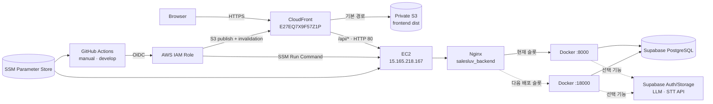

# SalesLuv 프론트엔드·백엔드 배포 정리 — _2 상세 비교본

> 기준 시각: 2026-08-23 21:07 KST  
> 기준 커밋: `7659b9d03b3c08cafd40ca285a445461ca691c30` (`develop`)  
> 근거: 저장소의 현행 코드·Git 이력, 지금까지 나눈 배포 관련 대화, 공개 GitHub Actions 실행 결과, 운영 URL 직접 점검

이 문서는 **현재 실제로 배포된 구성**, **그렇게 결정한 이유**, **처음 구축한 순서**, **앞으로 배포하는 순서**, **복구 방법과 남은 위험**을 한곳에 모은 상세 비교본이다. AWS 콘솔에서 만든 설정은 저장소에 IaC로 남아 있지 않으므로, 저장소 밖에서 확인한 설정은 그 사실을 구분해 적었다. 비밀번호·토큰·DB 접속 문자열·API 키·Discord Webhook 값은 의도적으로 기록하지 않는다.

## 1. 현재 상태 요약

| 구분 | 현재 상태 | 확인 근거 |
|---|---|---|
| 프론트엔드 | **배포 성공·접속 정상** | [Actions 실행 #32637253713](https://github.com/jexists/SKN30-FINAL-1Team-dev/actions/runs/32637253713), `/`와 `/login` HTTP 200 |
| 백엔드 | **배포 성공·DB 연결 정상** | [Actions 실행 #32637169832](https://github.com/jexists/SKN30-FINAL-1Team-dev/actions/runs/32637169832), `/api/health`와 `/api/health/db` HTTP 200 |
| 배포 커밋 | 프론트·백 모두 `7659b9d` | 두 성공 실행의 SHA가 동일함 |
| 배포 방식 | GitHub Actions에서 수동 실행 | 두 workflow 모두 `workflow_dispatch`만 사용 |
| 운영 브랜치 | `develop`만 허용 | workflow 내부 검사 + GitHub `production` environment + AWS OIDC trust |
| 사용자 진입점 | CloudFront 단일 origin | 프론트와 `/api/*`를 같은 HTTPS 호스트로 제공 |
| 커스텀 도메인 | 아직 없음 | CloudFront 기본 도메인을 사용 |

### 운영 주소

- 서비스: <https://d3m90og33enu6v.cloudfront.net>
- SPA 직접 진입 확인: <https://d3m90og33enu6v.cloudfront.net/login>
- API 기본 경로: <https://d3m90og33enu6v.cloudfront.net/api>
- 앱 상태: <https://d3m90og33enu6v.cloudfront.net/api/health>
- DB 상태: <https://d3m90og33enu6v.cloudfront.net/api/health/db>

2026-08-23 21:07 KST 직접 점검 결과는 다음과 같다.

| 점검 | 결과 |
|---|---|
| `/` | HTTP 200, S3 응답이 CloudFront를 통해 전달됨 |
| `/login` | HTTP 200, `index.html` 반환 — SPA rewrite 정상 |
| `/api/health` | HTTP 200, `{"status":"ok"}` — CloudFront → EC2 → Nginx → FastAPI 정상 |
| `/api/health/db` | HTTP 200, `{"status":"ok","database":"connected"}` — DB 연결 정상 |

이 점검은 **페이지/API/DB 기본 연결**까지만 증명한다. 로그인, 파일 업로드, LLM, STT, 전체 사용자 흐름은 별도 기능 점검이 필요하다.

## 2. 대화에서 정한 방향과 그 이유

| 논의한 요구·문제 | 최종 결정 | 이렇게 한 이유 |
|---|---|---|
| 프론트와 백엔드를 AWS에 먼저 올리고 싶음 | S3·CloudFront 프론트 + EC2·Docker 백엔드 | 현재 팀 규모와 단일 서비스에 필요한 최소 운영 구성이며, 이미 쓰는 AWS 안에서 빠르게 시작할 수 있음 |
| Redis·Celery·OCR·별도 AI 인프라도 함께 올릴지 | 이번 배포 범위에서는 제외 | 첫 배포의 변수를 줄이고 웹/API/DB 경로부터 안정화하기 위함. LLM·STT·Storage 값은 선택값으로 남김 |
| `develop`에 push할 때마다 자동 배포할지 | 프론트·백 각각 별도 **수동 버튼** | 초기 운영에서는 사람이 변경 범위와 순서를 확인한 후 올리는 편이 안전하고, 한쪽만 바뀌면 그쪽만 배포할 수 있음 |
| 모든 브랜치에서 버튼을 허용할지 | `develop`만 허용 | 임의 브랜치 코드를 production에 올리는 실수를 차단하기 위함 |
| 브랜치 제한을 어디에서 할지 | workflow, GitHub environment, AWS OIDC trust의 다중 방어 | 한 설정이 잘못돼도 다른 경계가 production 배포를 막도록 하기 위함 |
| AWS access key를 GitHub Secret에 둘지 | GitHub OIDC로 임시 역할 획득 | 장기 access key의 저장·회전·유출 위험을 없애기 위함 |
| 프론트와 API를 다른 공개 호스트로 둘지 | CloudFront 한 호스트에서 `/api/*`만 EC2로 라우팅 | 브라우저 mixed content를 피하고, CORS와 `Secure`·`SameSite=Lax`·host-only 쿠키 동작을 단순하게 유지하기 위함 |
| React Router 화면 새로고침 시 404 | CloudFront Function으로 확장자 없는 경로를 `/index.html`로 rewrite | `/login` 같은 SPA deep link를 S3 정적 호스팅에서도 열기 위함. `/api`와 실제 파일은 제외 |
| EC2 origin을 어떤 IP에 공개할지 | CloudFront managed prefix list를 보안 그룹에 허용 | CloudFront 출발 IP는 고정 단일 IP가 아니므로 개별 IP 허용은 깨지기 쉬움 |
| 백엔드를 EC2에서 어떻게 교체할지 | 포트 `8000`/`18000` 두 슬롯 + Nginx upstream 전환 | 새 컨테이너와 DB를 먼저 검사한 뒤 트래픽을 넘기고, 전환 실패 시 이전 슬롯으로 되돌리기 위함 |
| 컨테이너 이미지를 ECR에서 받을지 | EC2에서 정확한 Git SHA를 로컬 빌드 | 단일 인스턴스의 첫 운영 배포에서 레지스트리까지 추가하지 않고 구성 수를 줄이기 위함 |
| frontend의 오래된 해시 asset을 즉시 지울지 | 최근 3개 배포 세대 보존 | 이미 페이지를 열어 둔 브라우저가 이전 JS/CSS chunk를 요청할 수 있어 즉시 삭제하면 화면이 깨질 수 있음 |
| S3 저장 비용이 계속 늘어나는 문제 | marker 기준 3세대 정리 + version lifecycle | 열린 브라우저 호환성을 남기면서 무제한 누적을 막기 위함 |
| 배포 알림 실패를 배포 실패로 볼지 | Discord는 독립 job, `continue-on-error` | 알림 채널 장애가 정상 배포 결과를 뒤집지 않도록 하기 위함. 최종 기준은 Actions 결과임 |
| 프론트·백이 함께 바뀌었을 때 순서 | **백엔드 먼저, 프론트 나중** | 새 프론트가 아직 없는 API를 호출하는 시간을 피하고, API health를 확인한 뒤 화면을 공개하기 위함 |
| DuckDNS를 프론트 주소로 쓸지 | 현재는 CloudFront 기본 도메인 유지 | CloudFront 사용자 도메인에는 DNS CNAME/ALIAS와 ACM 인증서가 필요하며 DuckDNS만으로 원하는 형태를 안정적으로 구성하기 어려움 |

## 3. 현재 운영 아키텍처



### 요청 흐름

1. 브라우저는 항상 CloudFront의 HTTPS 주소에 접속한다.
2. 일반 화면·JS·CSS 요청은 private S3 origin으로 간다.
3. 확장자가 없는 SPA 경로는 CloudFront Function이 `/index.html`로 바꾼다.
4. `/api/*`는 별도 CloudFront behavior가 EC2 origin의 HTTP 80으로 전달한다.
5. EC2 Nginx는 named upstream `salesluv_backend`가 가리키는 현재 Docker 슬롯으로 전달한다.
6. FastAPI가 Supabase DB/Auth/Storage 및 선택적으로 LLM·STT 공급자를 호출한다.

브라우저 → CloudFront 구간은 HTTPS지만 **CloudFront → EC2 origin 구간은 현재 HTTP**다. 이 구간의 TLS는 아직 적용하지 않았다.

## 4. AWS·GitHub 리소스 목록

### 공통

| 항목 | 현재 값·구성 |
|---|---|
| AWS 리전 | `ap-northeast-2` (서울) |
| AWS 계정 | `816008167575` |
| GitHub 운영 환경 | `production` |
| 허용 브랜치 | `develop` |
| GitHub 인증 | `token.actions.githubusercontent.com` OIDC |
| OIDC subject 형태 | `repo:jexists/SKN30-FINAL-1Team-dev:environment:production` |
| 운영 알림 Secret 이름 | `DISCORD_WEBHOOK_URL` |

`production` environment의 승인자·보호 규칙과 IAM trust/policy 본문은 저장소 밖 설정이다. 대화 중 environment 기반 subject로 수정했으며 실제 성공 실행이 OIDC 역할 획득 성공을 증명한다. 다만 현재 AWS 설정을 재생성할 IaC 파일은 없다.

### 프론트엔드

| 항목 | 현재 값·구성 |
|---|---|
| S3 버킷 | `salesluv-frontend-prod-816008167575-ap-northeast-2-an` |
| S3 공개 설정 | public access 전체 차단, ACL 비활성화, CloudFront OAC만 사용 |
| S3 보호 | Versioning 활성화, SSE-S3 암호화 |
| S3 lifecycle | `expire-old-frontend-versions`: noncurrent version 최대 3개·14일, expired delete marker 제거, incomplete multipart 7일 후 제거 |
| CloudFront 이름 | `salesluv-frontend-prod` |
| Distribution ID | `E27EQ7X9F57Z1P` |
| Distribution ARN | `arn:aws:cloudfront::816008167575:distribution/E27EQ7X9F57Z1P` |
| CloudFront 도메인 | `d3m90og33enu6v.cloudfront.net` |
| 기본 origin | 위 private S3 버킷, Origin Access Control |
| 기본 root object | `index.html` |
| viewer 정책 | HTTP → HTTPS redirect, IPv6 활성화, HTTP/2 사용 |
| SPA Function | `salesluv-spa-rewrite`; 기본 S3 behavior의 viewer-request에만 연결 |
| API origin | `salesluv-backend-ec2` → EC2 public DNS, HTTP 80 |
| `/api/*` behavior | 모든 메서드, `CachingDisabled`, `AllViewerExceptHostHeader`, 압축 사용, viewer HTTP → HTTPS |
| WAF | 미적용 |
| 배포 IAM role | `SalesLuvFrontendDeployRole` |
| 배포 IAM policy | `SalesLuvFrontendDeployPolicy` |
| SSM parameter | `/salesluv/production/frontend/env` |

SPA Function은 `/api`와 확장자가 있는 asset 요청을 건드리지 않고, 그 외 확장자 없는 화면 경로를 `/index.html`로 보낸다. 그래서 `/login` 직접 접속도 200으로 확인된다.

### 백엔드

| 항목 | 현재 값·구성 |
|---|---|
| EC2 이름 | `salesluv-backend` |
| Instance ID | `i-0464d8283887dd6f5` |
| Elastic IP | `15.165.218.167` |
| Public DNS | `ec2-15-165-218-167.ap-northeast-2.compute.amazonaws.com` |
| Security Group | `sg-05a683084c82f8eb0` |
| CloudFront managed prefix list | `pl-22a6434b`, origin HTTP 80 허용 |
| GitHub 배포 IAM role | `salesluv-github-actions-deploy-role` |
| SSM parameter | `/salesluv/production/backend/env` |
| EC2 저장소 | `/opt/salesluv` |
| 임시 release 경로 | `/opt/salesluv-releases` |
| 런타임 env 파일 | `/opt/salesluv/runtime/backend.env`, 권한 `0600` |
| 배포 lock | `/var/lock/salesluv-backend-deploy.lock` |
| Nginx upstream 파일 | `/etc/nginx/conf.d/salesluv-backend-upstream.conf` |
| Nginx upstream 이름 | `salesluv_backend` |
| 슬롯 | `127.0.0.1:8000`, `127.0.0.1:18000` |
| 컨테이너 이름 | `salesluv-backend-8000`, `salesluv-backend-18000` |
| 이미지 이름 | `salesluv-backend:<40자리 Git SHA>` |

EC2의 OS·용량, instance profile, SSM Agent, Nginx server block, 인증서, SSH 관리 규칙은 workflow가 만들지 않는다. 이들은 수동으로 준비된 외부 상태다.

## 5. 처음 구축한 순서

다음은 대화와 커밋 이력을 기준으로 재구성한 **최초 1회 구축 순서**다. 일상 배포 절차는 6장을 따른다.

### 5.1 범위와 배포 원칙 확정

1. 이번 목표를 React 프론트, FastAPI 백엔드, 기존 Supabase 연동의 AWS 운영 배포로 제한했다.
2. Redis/Celery, 별도 OCR·AI 서버, WAF, 커스텀 도메인, origin TLS는 첫 배포에서 제외했다.
3. 자동 push 배포 대신 프론트·백 수동 workflow를 각각 만들기로 했다.
4. production 소스는 `develop`만 허용하고, 양쪽이 같이 바뀌면 백엔드부터 배포하기로 했다.

### 5.2 백엔드 컨테이너 준비

1. [backend/Dockerfile](../backend/Dockerfile)을 추가했다.
2. `uv:0.12.5-python3.13-trixie-slim` 기반에서 `uv sync --frozen --no-dev`로 lockfile 그대로 설치했다.
3. 앱 코드만 복사하고 UID/GID `10001` 비루트 사용자로 Uvicorn 단일 프로세스를 실행하도록 했다.
4. [backend/.dockerignore](../backend/.dockerignore)에서 `.env`, 테스트, SQL, 스크립트, 가상환경을 이미지 컨텍스트에서 제외했다.

### 5.3 EC2·Nginx·SSM 준비

1. 단일 EC2에 Docker, Nginx, Git, AWS CLI, curl, SSM Agent와 필요한 IAM instance 권한을 준비했다.
2. `/opt/salesluv`에 저장소와 `origin`을 준비했다.
3. Nginx server block의 `/api` proxy가 직접 포트가 아니라 `http://salesluv_backend` named upstream을 보도록 변경했다.
4. `/etc/nginx/conf.d/salesluv-backend-upstream.conf`를 만들고 `127.0.0.1:8000` 또는 `:18000` 중 하나만 가리키게 했다.
5. 파일 소유권·권한을 Nginx가 읽고 배포 스크립트가 원자 교체할 수 있게 맞춘 뒤 `nginx -t`와 reload를 확인했다.
6. `/salesluv/production/backend/env` SecureString을 dotenv 형태로 만들었다. 실제 값은 문서나 Git에 남기지 않았다.

### 5.4 프론트 S3·CloudFront 준비

1. private S3 버킷을 만들고 public access 차단, ACL 비활성화, versioning, SSE-S3를 설정했다.
2. 오래된 version을 3개/14일 범위로 정리하는 lifecycle을 추가했다.
3. CloudFront distribution과 S3 Origin Access Control을 만들고 기본 root를 `index.html`로 설정했다.
4. `salesluv-spa-rewrite` Function을 기본 S3 behavior의 viewer-request에 연결했다.
5. EC2 public DNS를 backend origin으로 추가하고 `/api/*` behavior를 만들었다.
6. CloudFront에서 EC2로 오는 HTTP 80을 허용하도록 EC2 보안 그룹에 managed prefix list `pl-22a6434b`를 추가했다. 단일 CloudFront IP를 허용하지 않은 이유는 출발 IP가 바뀔 수 있기 때문이다.
7. 프론트 SSM 파라미터 `/salesluv/production/frontend/env`에 같은 CloudFront origin을 `VITE_API_BASE_URL`로 넣었다.
8. 백엔드 `CORS_ORIGINS`도 같은 HTTPS origin과 일치시켰다.

### 5.5 GitHub OIDC·권한 준비

1. GitHub OIDC provider를 AWS IAM에 연결했다.
2. backend role과 frontend role을 분리했다.
3. frontend role에는 대상 버킷 list/object 쓰기·삭제, CloudFront invalidation, frontend SSM parameter 읽기만 허용했다.
4. role trust를 GitHub 저장소와 `production` environment subject로 제한했다.
5. GitHub에 `production` environment를 만들고 `develop` 보호 경계로 사용했다.
6. 처음 branch subject로 잡혀 있던 frontend role trust는 job에 `environment: production`을 붙이면 subject 모양이 달라져 OIDC가 거부됐다. trust를 environment subject로 고쳐 해결했다.

### 5.6 workflow 구현·병합·첫 배포

1. [deploy-backend.yml](../.github/workflows/deploy-backend.yml), [deploy-frontend.yml](../.github/workflows/deploy-frontend.yml), [deploy.sh](../deploy/backend/deploy.sh)를 구현했다.
2. review에서 exact SHA 검증, SSM 취소, dotenv 검증, 두 슬롯 전환, rollback, 안전한 S3 삭제 범위, Discord 독립 알림을 강화했다.
3. side branch의 `3db7ea0`·`d898a62` 작업을 PR #58의 squash commit `b761e39`로 `develop`에 반영했다. 세 커밋이 `develop`에 연속으로 들어간 것은 아니다.
4. 백엔드를 먼저 실행하며 IAM/Nginx/스크립트 오류를 해결했다.
5. 프론트를 실행하며 IAM trust와 release marker 오류를 해결했다.
6. `7659b9d`에서 백엔드를 성공시킨 뒤 같은 SHA로 프론트를 성공시켰다.
7. CloudFront의 `/`, `/login`, `/api/health`, `/api/health/db`를 다시 확인했다.

## 6. 앞으로 배포하는 순서

### 6.1 공통 사전 확인

1. 배포하려는 변경이 `develop`에 merge됐고 로컬·원격 SHA가 맞는지 확인한다.
2. 해당 SHA의 CI를 확인한다.
   - 백엔드: uv 의존성 설치 → Ruff lint/format → pytest → 배포 스크립트 구문·runtime 테스트
   - 프론트: npm 설치 → oxlint → Prettier → TypeScript/Vite build
3. 스키마 변경이 있으면 배포 전에 [backend/sql/README.md](../backend/sql/README.md)의 수동 절차로 production DB에 적용하고 기록한다. 현재 workflow는 migration을 실행하지 않는다.
4. 설정 변경이 있으면 SSM 값을 먼저 수정하되 이전 값을 안전하게 백업한다.
5. `VITE_API_BASE_URL`과 `CORS_ORIGINS`가 같은 CloudFront HTTPS origin을 가리키는지 확인한다.
6. 변경 범위를 판단한다.
   - backend만 변경: backend만 배포
   - frontend만 변경: frontend만 배포
   - API 계약·CORS·양쪽 변경: **backend → 확인 → frontend → 브라우저 확인**

workflow가 CI 성공을 자동으로 강제하지 않으므로 2번은 운영자가 반드시 확인해야 한다.

### 6.2 백엔드 배포 버튼 실행

1. GitHub → **Actions** → **Deploy Backend**로 이동한다.
2. **Run workflow**에서 `develop`을 선택하고 실행한다.
3. `production` environment 승인이 표시되면 변경 SHA와 실행자를 확인하고 승인한다.
4. [실행 상세 화면](https://github.com/jexists/SKN30-FINAL-1Team-dev/actions/workflows/deploy-backend.yml)에서 `Deploy backend to production`이 끝날 때까지 기다린다.
5. 실패하면 Discord 메시지만 보지 말고 Actions의 `Deploy the exact commit through SSM` 출력과 EC2 error tail을 확인한다.

CLI를 쓰면 다음과 같다.

```bash
gh workflow run deploy-backend.yml --ref develop
```

#### workflow 내부 실행 순서

1. `GITHUB_REF == refs/heads/develop`인지 검사한다.
2. OIDC로 `salesluv-github-actions-deploy-role`을 맡는다. AWS 장기 키는 쓰지 않는다.
3. SSM `AWS-RunShellScript`를 EC2 `i-0464d8283887dd6f5`에 보낸다.
4. EC2가 `origin/develop`을 depth 1로 fetch하고, 그 SHA가 Actions의 `GITHUB_SHA`와 정확히 같은지 검사한다. branch가 실행 중 이동하면 오래된 실행을 거부한다.
5. 그 commit에서 `deploy/backend/deploy.sh`만 임시 파일로 추출해 실행한다.
6. host의 `flock`을 잡아 다른 backend 배포와 겹치지 않게 한다. GitHub concurrency도 같은 목적의 1차 잠금이다.
7. 현재 Nginx upstream 포트와 활성 컨테이너를 판별한다.
8. SSM `/salesluv/production/backend/env`를 복호화해 임시 `0600` 파일로 받고 형식·필수값·production 보안값을 검증한다.
9. 이전 env를 백업한 뒤 `/opt/salesluv/runtime/backend.env`를 원자 교체한다.
10. 정확한 SHA에서 `git archive backend`로 격리 build context를 만들고 EC2에서 BuildKit으로 `salesluv-backend:<SHA>`를 빌드한다. ECR은 사용하지 않는다.
    - 빌드 직전에 `/var/lib/containerd`와 `/var/lib/docker`의 여유 공간 중 작은 값을 잰다. 측정에 실패한 경로는 건너뛸 뿐 0으로 세지 않는다.
    - 16 GiB 미만이면 남은 release context를 지우고 빌드 캐시를 5 GB로 제한한다. 캐시 크기 상한 플래그가 없는 Docker 버전에서는 `until=72h`로 폴백한다. dangling 레이어도 함께 정리한다.
    - 그래도 8 GiB 미만일 때만 빌드 캐시를 전부 버린다. 컨테이너, 태그된 이미지, Docker volume은 어느 단계에서도 건드리지 않는다.
    - 빌드가 `no space left on device`로 실패하면 빌드 캐시를 전부 버리고 한 번만 재시도한다. 다른 원인의 실패는 즉시 배포를 중단한다.
11. 비활성 포트에 새 컨테이너를 띄운다.
    - `--restart unless-stopped`
    - host loopback에만 publish
    - JSON log `10 MB × 3`
    - 버전 고정 딜 모델 디렉터리를 읽기 전용 bind mount
12. 후보 슬롯에서 `/api/health`와 `/api/health/db`를 각각 확인한다. 최대 30회, 2초 간격, 요청 timeout 5초다.
13. 후보 컨테이너 안에서 딜 모델의 해시·계약·기준 16건 추론을 최대 300초 동안 검증한다.
14. 세 점검이 모두 성공해야 Nginx upstream 파일의 포트를 원자 교체한다.
15. `nginx -t` 후 reload하고, 실제 upstream이 새 포트인지 다시 검사한다.
16. 이전 슬롯은 10초 drain한 뒤 최대 30초를 주고 중지·삭제한다.
17. 현재 이미지와 직전 이미지 ID만 남기고 더 오래된 SHA 이미지를 best effort로 정리한다.
18. SSM 상태가 `Success`이고 response code가 `0`일 때만 Actions가 성공한다.
19. 성공·실패 결과를 Discord에 보낸다. 알림 실패는 배포 결과를 바꾸지 않는다.

Actions는 SSM 명령 실행 2,100초, 전달 60초, polling 2,250초, 취소 확인 60초 제한을 둔다. Actions가 중단되면 끝나지 않은 SSM 명령의 취소를 요청한다.

### 6.3 백엔드 확인

다음 요청이 모두 성공한 뒤 frontend 배포로 넘어간다.

```bash
curl -fsS https://d3m90og33enu6v.cloudfront.net/api/health
curl -fsS https://d3m90og33enu6v.cloudfront.net/api/health/db
```

그다음 실제 브라우저에서 로그인과 변경된 API 한 건을 확인한다. 배포 과정은 딜 모델까지 별도로 검증하지만, 기본 health는 DB의 `select 1`만 확인하므로 스키마, RLS, Auth, Storage, LLM, STT 정상까지 의미하지 않는다.

### 6.4 프론트엔드 배포 버튼 실행

1. GitHub → **Actions** → **Deploy Frontend**로 이동한다.
2. **Run workflow**에서 `develop`을 선택하고 실행한다.
3. `production` environment 승인 시 SHA를 확인한다.
4. [실행 상세 화면](https://github.com/jexists/SKN30-FINAL-1Team-dev/actions/workflows/deploy-frontend.yml)에서 configuration, build, deploy 세 job이 모두 성공하는지 확인한다.

CLI를 쓰면 다음과 같다.

```bash
gh workflow run deploy-frontend.yml --ref develop
```

#### workflow 내부 실행 순서

1. configuration job이 `develop`인지 검사하고 OIDC로 frontend role을 맡는다.
2. SSM `/salesluv/production/frontend/env`를 복호화한다.
3. dotenv를 파싱해 `VITE_*`만 허용하고 NUL, 중복 key, 잘못된 따옴표·문법을 거부한다.
4. `VITE_API_BASE_URL`이 존재하고 비어 있지 않은지 확인한다.
5. build job이 exact commit을 checkout하고 `.nvmrc`의 Node 24를 준비한다.
6. `frontend`에서 `npm ci` 후 `npm run build`를 실행한다. 실제 명령은 `tsc -b && vite build`다.
7. `frontend/dist`를 `salesluv-frontend-dist` artifact로 올린다. 보존 기간은 1일이다.
8. deploy job이 artifact를 받고 `dist/index.html`과 `dist/assets` 존재를 확인한다.
9. OIDC로 frontend role을 다시 맡는다.
10. `assets/`를 먼저 S3에 전부 `cp`하고 `public,max-age=31536000,immutable`을 준다. 같은 파일도 다시 올려 현재 세대의 `LastModified`를 갱신한다.
11. 나머지 root 파일을 `sync --delete`하고 `no-cache,no-store,must-revalidate`를 준다. `assets/*`와 `_salesluv/*`는 이 삭제에서 제외한다.
12. CloudFront `/*` invalidation을 생성한다.
13. `_salesluv/frontend-releases/<run-id>-<attempt>.marker`를 만든다.
14. 최신 marker 3개를 기준으로 그보다 오래된 `assets/`와 marker만 최대 1,000개씩 안전한 prefix 검증 후 삭제한다.
15. 결과를 Discord에 보낸다.

`VITE_*` 값은 빌드 결과 JS에 포함되는 **공개 설정**이다. API key, token, 비밀번호를 넣으면 안 된다.

### 6.5 프론트·통합 확인

1. CloudFront `/`가 200인지 확인한다.
2. `/login`처럼 실제 SPA 경로를 주소창에 직접 넣고 새로고침해 200인지 확인한다.
3. JS/CSS가 정상 로드되고 화면에 흰 화면이나 이전 chunk 404가 없는지 확인한다.
4. 로그인 → `/api` 호출 → 새로고침 후 세션 복원이 되는지 확인한다.
5. 변경된 주요 화면과 API를 최소 한 번 실행한다.
6. 필요하면 CloudFront invalidation 상태를 AWS 콘솔에서 확인한다. 현재 workflow는 invalidation 완료까지 기다리지 않고 생성 성공만 확인한다.

## 7. 환경변수와 비밀값 관리

### 프론트 SSM `/salesluv/production/frontend/env`

| 이름 | 필수 | 용도 |
|---|---|---|
| `VITE_API_BASE_URL` | 예 | API 앞부분. 현재는 동일 CloudFront origin을 사용 |
| 그 외 `VITE_*` | 선택 | 추가 공개 build-time 설정 |

### 백엔드 SSM `/salesluv/production/backend/env`

| 이름 | 배포 검증 | 용도 |
|---|---|---|
| `APP_ENV` | 필수, `production` | 운영 모드 |
| `DEBUG` | 필수, `false` | 운영 debug 차단 |
| `CORS_ORIGINS` | 필수, 비어 있지 않은 HTTPS origin | 브라우저 허용 origin |
| `DATABASE_URL` | 필수, 비어 있지 않음 | Supabase PostgreSQL 접속 |
| `SUPABASE_PUBLISHABLE_KEY` | 필수, 비어 있지 않음 | Supabase Auth 로그인 |
| `LOGIN_MAX_ATTEMPTS` | 선택 | IP별 로그인 제한 횟수, 기본 5 |
| `LOGIN_WINDOW_SECONDS` | 선택 | 로그인 제한 구간, 기본 60초 |
| `REFRESH_COOKIE_MAX_AGE_SECONDS` | 선택 | refresh·signed-in cookie 수명 |
| `SUPABASE_URL` | 선택 | DB URL에서 project URL을 못 구할 때 명시 |
| `SUPABASE_SECRET_KEY` | 기능상 필요 | Storage 서버 접근 |
| `SUPABASE_STORAGE_BUCKET` | 기능상 필요 | 업로드 버킷 |
| `UPLOAD_MAX_BYTES` | 선택 | 업로드 크기 제한 |
| `LLM_API_URL`, `LLM_API_KEY`, `LLM_MODEL` | 기능상 필요 | LLM 기능 |
| `LLM_TIMEOUT_SECONDS` | 선택 | LLM timeout |
| `STT_API_KEY`, `STT_MODEL` | 기능상 필요 | 음성 전사 기능 |
| `STT_TIMEOUT_SECONDS`, `STT_MAX_BYTES` | 선택 | STT timeout·파일 제한 |

Storage·LLM·STT 관련 값은 배포 필수 검증 대상이 아니다. 값이 빠져도 기본 health가 통과할 수 있고 해당 기능만 503이 될 수 있으므로 기능별 smoke test가 필요하다.

### 쿠키·CORS 계약

- 프론트 Axios base URL은 `${VITE_API_BASE_URL}/api`이며 `withCredentials: true`다.
- 백엔드는 CORS allowlist를 정확 일치로 검사하고 credentials를 허용한다.
- production auth cookie는 `Secure`, `SameSite=Lax`, host-only다.
- `salesluv_signed_in` 표시 cookie를 프론트 JS가 읽어 세션 복원 여부를 결정한다.
- 따라서 같은 CloudFront 호스트 아래의 화면과 `/api` 구조를 유지하는 것이 현재 코드와 가장 잘 맞는다. API를 별도 site로 옮기면 CORS뿐 아니라 cookie domain/SameSite와 signed-in hint를 다시 설계해야 한다.

## 8. 빌드·배포 구현 상세

### 프론트엔드

- 기술: React, TypeScript, Vite, Node 24, npm lockfile.
- CI: `npm ci` → oxlint → Prettier check → `tsc -b && vite build`.
- deploy build는 lint/format을 다시 돌리지 않고 build만 한다.
- build artifact는 1일만 보존한다.
- 배포 후 외부 HTTP smoke test와 invalidation 완료 대기는 workflow에 없다.
- 최근 3 asset 세대 보존은 열린 브라우저 호환용이지 rollback 기능이 아니다. 이전 `index.html`을 자동 복원하지 않는다.
- S3 versioning lifecycle은 object version 복구 수단이며 marker 세대 정리와 별개다.
- 현재 build에서 큰 JS bundle 경고가 있었지만 배포 실패 조건은 아니었다. 성능 개선 대상이다.

### 백엔드

- 기술: FastAPI, Uvicorn, Python 3.13, uv lockfile.
- 컨테이너는 단일 Uvicorn worker이며 reload하지 않는다.
- host volume, Docker `HEALTHCHECK`, CPU/메모리 제한, read-only root filesystem, capability 제한은 없다.
- DB migration은 image와 deploy workflow에 포함되지 않는다. SQL 파일도 Docker context에서 제외된다.
- `/api/health/db`는 `select 1`만 실행한다. 테이블·column·RLS·migration version은 검사하지 않는다.
- Supabase production migration 적용 이력은 저장소에 기록돼 있지 않다. 현재 [backend/sql/README.md](../backend/sql/README.md)에는 development 적용 기록만 있다.
- baseline SQL은 RLS를 활성화하지만 production의 policy·role 동작은 health로 검증되지 않는다.
- Agent 장기 작업은 프로세스 내부 `BackgroundTasks`다. Redis/Celery 같은 영속 queue가 없어 배포·재시작 시 진행 중 작업이 유실될 수 있다.
- 로그인 rate limit은 프로세스 메모리·IP 기준이다. Nginx/Uvicorn이 실제 사용자 IP를 올바르게 전달하지 않으면 여러 사용자가 한 proxy IP로 묶일 수 있다.

### CI·배포 연결

- backend CI는 `backend/**`, `deploy/backend/**`, backend CI workflow 변경에 반응한다.
- frontend CI는 `frontend/**`, frontend CI workflow 변경에 반응한다.
- `deploy-backend.yml`과 `deploy-frontend.yml` 자체 변경은 각 CI path trigger에 포함되지 않는다.
- deploy workflow는 해당 SHA의 CI 성공 여부를 API로 검사하지 않는다.
- backend CI는 Docker image build나 실제 AWS/Nginx 통합 테스트를 하지 않는다.
- frontend deploy는 공개 URL, CORS, login까지 자동 검사하지 않는다.
- 프론트·백 workflow는 서로 독립이라 같은 SHA와 실행 순서를 시스템이 강제하지 않는다.

## 9. 실패 시 복구 순서

### backend 배포 도중 실패

1. 후보 health 전 실패하면 Nginx production upstream은 바뀌지 않는다.
2. 새 env를 설치한 뒤 실패하면 이전 env를 복원한다.
3. Nginx 전환 도중 실패하면 이전 upstream과 env를 복원하고 이전 슬롯 health를 다시 확인한다.
4. rollback이 정상 완료되면 후보 컨테이너와 새 이미지를 정리한다.
5. upstream 복구가 실패한 경우 추가 손상을 피하려고 새 컨테이너를 보존하고 수동 점검 메시지를 남긴다.
6. Actions의 SSM stdout/stderr, Nginx config, 두 포트 health를 확인한 후 원인을 수정해 새 commit으로 다시 배포한다.

### backend 성공 후 문제 발견

과거 SHA를 버튼에서 선택하는 기능과 성공 후 one-click rollback은 없다. workflow는 항상 현재 `origin/develop` HEAD와 정확히 같은 SHA만 허용한다.

1. 추가 배포를 중단한다.
2. 마지막 정상 commit과 문제 commit을 확인한다.
3. `develop`에서 문제 commit을 **revert하는 새 commit**을 만든다. history를 reset하지 않는다.
4. CI 통과 후 Backend workflow를 다시 실행한다.
5. API·DB·로그인·변경 기능을 확인한다.
6. API 계약이 되돌아갔다면 호환되는 frontend도 이어서 배포한다.

직전 Docker image ID는 남지만 이를 직접 다시 실행하는 표준 스크립트는 없다. 수동 컨테이너 교체보다 revert 후 정식 배포가 기준 절차다.

### frontend 실패·문제 발견

1. asset 업로드 도중 실패해도 기존 `index.html`이 유지되면 기존 화면은 계속 동작한다.
2. root sync 후 실패한 경우 일부 새 파일이 이미 공개됐을 수 있으므로 Actions 실패만 보고 기존 상태라고 단정하지 않는다.
3. 정상 commit을 `develop`에 revert하고 Frontend workflow를 다시 실행한다.
4. S3 versioning으로 긴급 복원할 경우 정상 `index.html`과 관련 root object version을 복구한 뒤 CloudFront `/*` invalidation을 해야 한다.
5. 최근 3세대 asset 보존만으로는 rollback되지 않는다. 정상 `index.html` 복원이 함께 필요하다.
6. `/`, deep link, chunk 로딩, 로그인/API를 다시 확인한다.

## 10. 완료된 것과 남은 일

| 상태 | 항목 | 영향·다음 조치 |
|---|---|---|
| 완료 | S3 + CloudFront 프론트 배포 | 현재 운영 URL 200 확인 |
| 완료 | EC2 + Docker + Nginx 두 슬롯 backend 배포 | API·DB health 200 확인 |
| 완료 | OIDC·develop 제한·production environment | 장기 AWS key 없이 수동 배포 성공 |
| 완료 | 같은 origin `/api/*` 연결 | HTTPS 화면에서 쿠키 포함 API 호출 가능한 토폴로지 |
| 완료 | SPA rewrite | `/login` 직접 진입 확인 |
| 완료 | frontend 3세대 asset 정리 + S3 version lifecycle | 비용과 열린 브라우저 호환성 절충 |
| 미완료 | 커스텀 도메인·ACM | 현재 CloudFront 기본 도메인 사용 |
| 미완료 | CloudFront → EC2 TLS | origin 구간은 HTTP 80. ALB+ACM 또는 backend 도메인/Nginx 인증서 검토 |
| 미완료 | WAF·정교한 origin 보호 | WAF 미적용; 보안 그룹·관리 규칙 정기 검토 필요 |
| 미완료 | 자동 post-deploy smoke test | home/deep link/API/DB/login 검사와 invalidation wait 자동화 필요 |
| 미완료 | CI → deploy 강제 gate | deploy 전에 동일 SHA CI 성공을 검사하도록 보강 필요 |
| 미완료 | deploy workflow 자체 CI | actionlint/YAML 검증과 Docker build 테스트 범위 추가 필요 |
| 미완료 | production DB migration 증적·자동화 | 적용 이력과 schema/RLS 검증 절차 마련 필요 |
| 미완료 | 성공 후 표준 rollback | 정상 SHA 입력 또는 승인된 rollback workflow 설계 필요 |
| 미완료 | IaC | IAM, S3, CloudFront, EC2, SG, Nginx 설정을 Terraform/CloudFormation 등으로 코드화 필요 |
| 미완료 | 중앙 로그·지표·경보 | Actions/Discord 외 애플리케이션·EC2·Nginx 모니터링 필요 |
| 미완료 | 영속 background queue | 배포 중 Agent 작업 유실 방지를 위해 Redis/Celery 등 검토 |
| 확인 필요 | 실제 사용자 IP 전달 | Nginx real IP와 Uvicorn proxy header 설정 검증 |
| 확인 필요 | 선택 기능 smoke | Storage·LLM·STT env와 실제 호출을 각각 확인 |
| 문서 불일치 | README·`docs/tech-stack.md` | AWS/Docker를 아직 “도입 예정”으로 표시하므로 추후 현행화 필요 |

## 11. 운영 시 하지 말아야 할 것

- `main`이나 feature branch에서 production workflow를 우회 실행하지 않는다.
- AWS access key를 GitHub Secret에 추가하지 않는다. OIDC를 유지한다.
- `.env`, SSM 실제 값, API key, DB URL, Discord Webhook을 문서·로그·commit에 남기지 않는다.
- `VITE_*`에 비밀값을 넣지 않는다. 브라우저 bundle에 공개된다.
- backend schema 변경을 SQL 적용 없이 앱부터 배포하지 않는다.
- 프론트 asset을 marker·prefix 검증 없이 임의 대량 삭제하지 않는다.
- 실패한 backend 배포에서 자동 rollback 상태를 확인하기 전에 기존 컨테이너나 upstream 파일을 지우지 않는다.
- frontend와 backend가 함께 바뀐 경우 frontend를 먼저 올리지 않는다.
- Discord 알림 성공만 보고 배포 성공으로 판단하지 않는다.
