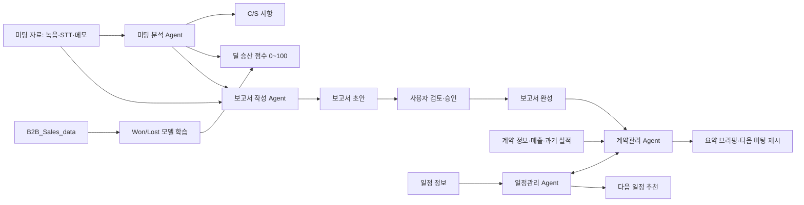

# 데이터 수집 보고서

> 목적: SalesLuv 서비스에 사용할 데이터의 출처, 수집 범위, 저장 방식과 품질 기준을 정의한다.
> 기준 문서: `docs/technical/SalesLuv_ERD.md`, `customer-insight-agent.md`

## 1. 데이터 수집 목적

- 고객·미팅·계약·일정 이력을 연결해 영업 활동을 관리한다.
- 미팅 자료에서 C/S 사항을 추출하고 계약 정보와 함께 딜 승산 점수를 산출한다.
- 미팅 원문과 C/S 내용을 바탕으로 보고서 초안을 작성하고 사용자 승인 후 계약관리 흐름에 전달한다.

## 2. 데이터 수집 범위

| 구분 | 수집 내용 | ERD 저장 위치 |
| --- | --- | --- |
| 고객 기본 정보 | 고객사명, 지역, 담당자, 부서·직급, 연락처, 담당 영업사원, 상태·유입 경로 | `customer_company`, `customer_contact` |
| 미팅·일정 | 담당자, 상품·계약, 활동 유형, 시작·종료·마감 시각, 장소, 완료 여부, 메모 | `activity`, `activity_companion` |
| 승인 보고서 | 미팅 원문, 보고서 본문, 승인 상태·승인자·승인 시각, AI 근거 | `report`, `report_activity`, `file` |
| 미팅 분석 결과 | C/S 사항, 딜 승산 점수, 분석 근거 | `agent_run.output_snapshot`, `agent_run.evidence` |
| C/S 관리 | 미팅에서 추출한 C/S 내용, 처리 담당자·상태·답변 이력 | `support_request`, `support_response` |
| 영업 기회·계약 | 고객·상품·담당자, 영업 단계, 계약 유형·금액·기간, 납품 예정 | `contract`, `pipeline_stage` |
| 발주 | 공급처, 발주 상태, 납기·입고일, 품목·수량·단가 | `purchase_order`, `purchase_order_item` |

| 논리 ID | ERD 매핑 |
| --- | --- |
| `customer_id` | `customer_company.id` |
| `contact_id` | `customer_contact.id` |
| `meeting_id`, `schedule_id` | `activity.id` |
| `report_id` | `report.id` |
| `opportunity_id` | `contract.id` |

## 3. 데이터 출처

### 3.1 현재 보유 자료

- 의료기기 가격 목록 후보: `data/sample/★MEDICAL_DEVICE_PRICE_LIST_2020.7.15기준_게시용_데모.xlsx`
- 변형 매출·영업 데이터: `data/sample/3개회사_매출데이터_2022-2024_샘플완료.xlsx`, `data/sample/Sales_DB.xlsx`
- 비식별 발주·미납·계약·인허가 문서: `data/sample/`, `data/sanitized_docs/`
- 위 자료의 실제 출처, 수집 건수 및 라이선스: `확인 필요`

### 3.2 서비스 운영 데이터

영업 담당자가 서비스에서 직접 입력한 고객·미팅·계약·일정과 Agent 분석 결과를 누적한다. 미팅 분석 Agent는 녹음·STT, 미팅 메모 또는 직접 입력한 자료를 분석하고, 보고서 작성 Agent는 미팅 원문과 전달받은 C/S 내용을 사용해 초안을 생성한다.

### 3.3 외부 학습 데이터

- 데이터셋: [Hugging Face `markobo/B2B_Sales_data`](https://huggingface.co/datasets/markobo/B2B_Sales_data)
- 공개 페이지 확인값: 영어 CSV, train 448행, 23개 범주형 컬럼
- 목표값: `Status`의 `Won`·`Lost`
- 라이선스: `CC BY 4.0`(2026-08-17 확인)
- 사용 목적: 초기 계약 성사 분류 모델 학습·검증
- 관리 항목: 저작자·원본 URL·라이선스 표시, 다운로드 리비전·취득일·체크섬·전처리 이력 기록

이 데이터셋 외의 외부 공개 CRM 데이터는 컬럼 설계와 모델링 방식 검토용으로만 사용한다.

## 4. 주요 컬럼과 활용 목적

### 4.1 서비스 데이터

| 주요 컬럼 | 활용 목적 |
| --- | --- |
| `customer_company.id`, `customer_contact.id` | 고객·담당자 이력 연결 |
| `activity.starts_at`, `completed_at` | 최근 접촉일, 다음 일정, 완료 여부 계산 |
| `report.status_code`, `reviewed_by_member_id`, `reviewed_at` | 승인 보고서 판별 |
| `report.content`, `transcript`, `ai_evidence` | 보고서 원문·분석 근거와 승인 결과 |
| `contract.stage_id`, `pipeline_stage.outcome_code` | 영업 단계와 계약 결과 판정 |
| `contract.amount`, `contract_date`, `ends_on` | 계약 금액·기간 분석 |
| `agent_run.source_refs`, `input_snapshot` | 미팅·계약·일정 원천 ID와 정제 입력 기록 |
| `agent_run.output_snapshot`, `evidence` | C/S 사항·딜 승산 점수와 판단 근거 저장 |
| `agent_run.model_name`, `prompt_version` | 모델 실행 재현성 확보 |

### 4.2 외부 학습 데이터

주요 입력 컬럼은 `Product`, `Seller`, `Authority`, `Comp_size`, `Competitors`, `Budgt_alloc`, `RFI`, `RFP`, `Source`, `Client`, `Scope`, `Deal_type`, `Needs_def` 등이며 `Status`를 목표값으로 사용한다.

- `Unknown`은 임의로 `No`로 바꾸지 않고 별도 범주 또는 결측으로 처리한다.
- `Status`는 입력 피처에서 제외해 데이터 누수를 막는다.
- 외부 `Seller`, `Product` 값을 내부 `member`, `product` ID와 직접 연결하지 않는다.
- 전처리 후 유효 건수, 클래스 분포, 분할 비율과 모델 성능: `구현 후 기입`

딜 승산 점수는 0~100점으로 산출해 화면에 표시하며 사용자 승인 대상이 아니다. 보고서 초안은 미팅 원문과 C/S 사항을 사용하고 사용자 승인 후 완성한다. 딜 승산 점수용 ML 입력값은 보고서 작성에 전달하지 않는다.

## 5. 데이터 수집·저장 흐름

- 원본: `data/raw/` — Git 제외
- 변형 표 데이터: `data/sample/`
- 비식별 문서: `data/sanitized_docs/`
- 전처리 결과: `data/processed/`
- 운영 데이터: ERD 기반 관계형 DB
- 실제 업로드 파일: 파일 저장소, DB에는 `file.storage_key`와 메타데이터 저장

## 6. 데이터 품질 관리 기준

| 항목 | 기준 |
| --- | --- |
| 중복 | PK·고유번호 중복 차단, 의심 고객은 병합 후보로만 표시 |
| 결측치 | 필수 ID·고객명·시각·상태 누락 차단, `Unknown`과 미입력을 구분 |
| 날짜 | 날짜는 `YYYY-MM-DD`, 일시는 ISO 8601과 시간대 사용, 시작·종료 순서 검사 |
| 전화번호 | 비교용 정규화 값을 사용하고 원문 접근을 제한; 상세 규칙 `확인 필요` |
| 우편번호 | 문자열로 저장해 선행 0 보존; 현행 ERD 반영 여부 `확인 필요` |
| ID 연결 | FK가 없는 고아 레코드 적재 차단 |
| 승인 | 보고서 초안은 사용자 승인 후 완성 상태로 저장하고 승인자·승인 시각을 함께 확인 |
| 값 범위 | 딜 승산 점수 0~100, 금액 0 이상, 허용 코드 목록 적용 |
| 학습 누수 | 예측 시점 이후 계약 결과와 목표값 `Status`를 입력 피처에서 제외 |

## 7. 개인정보 및 민감정보 유의사항

- 이름, 연락처, 이메일, 상세주소, 음성·STT는 필요한 범위만 수집하고 접근 권한을 제한한다.
- 환자·건강정보, 주민등록번호, 계좌·카드번호, 비밀번호, 인증정보, 서명·도장 이미지는 수집·Git 저장·모델 입력에서 제외한다.
- 실제 고객·영업 정보가 포함된 원본은 Git에 커밋하지 않고 비식별 자료만 개발·데모에 사용한다.
- 외부 모델 전송 전 처리 목적, 전송 항목, 보관 여부와 이용 조건을 확인한다.
- 보존 기간, 파기 주기와 외부 모델 처리방침: `확인 필요`

## 8. 단계별 수집 단계

| 단계 | 주요 작업 |
| --- | --- |
| 1. 자료 확인 | 보유 자료의 출처·건수·라이선스·개인정보 확인 |
| 2. 학습 데이터 확보 | `B2B_Sales_data` 리비전·체크섬·취득일 기록 |
| 3. 전처리 | 중복·결측·범주 검사, `Status` 분리, 인코딩과 데이터 분할 |
| 4. 서비스 수집 | 고객·미팅·보고서·계약·일정 및 미팅 분석 결과 누적 |
| 5. 모델 검증 | 외부 데이터 학습 결과 평가 후 딜 승산 점수에 적용 |
| 6. 품질 관리 | 중복·결측·형식·FK·승인·근거 오류 정기 점검 |

## 확인 필요 항목

- [ ] 현재 보유 공공·샘플 자료의 출처, 건수, 라이선스
- [ ] `B2B_Sales_data` 리비전, 취득일, 체크섬, 클래스 분포와 전처리 후 건수
- [ ] 전화번호·우편번호 정규화 및 고객사 주소 저장 여부
- [ ] 개인정보 보존·파기와 외부 모델 전송 정책
- [ ] 데이터 분할 기준, 평가 지표와 모델 성능
